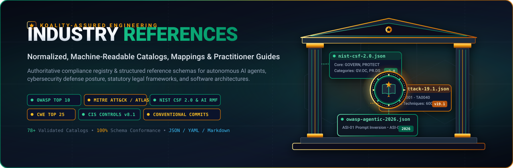
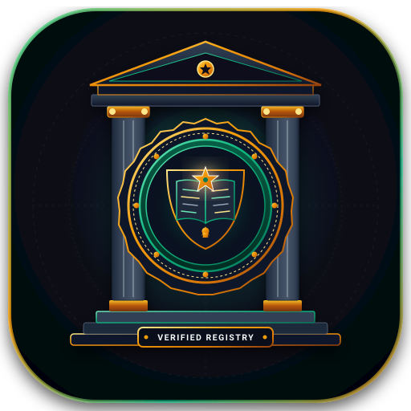
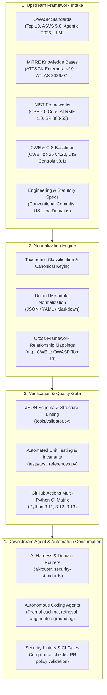

<div align="center">



<br/><br/>



# Koality-Assured Industry References

**Normalized, Machine-Readable Catalogs, Mappings & Practitioner Guides for Cybersecurity and Engineering Frameworks**

[](https://github.com/Koality-Assured/industry-references/actions/workflows/ci.yml)
[](LICENSE)
[](references/)
[]()
[](https://www.python.org/)
[](https://conventionalcommits.org)

<br/>

</div>

Normalized, machine-readable catalogs, mappings, and practitioner guides for industry cybersecurity, AI governance, and engineering frameworks. This repository serves as the single source of truth for authoritative reference schemas consumed by autonomous AI agents, security linting pipelines, and compliance automation across the Koality-Assured ecosystem.

---

## Mission Statement

Provide centralized, verified, machine-readable reference schemas, cross-framework mappings, and practitioner guides for industry engineering, cybersecurity, AI safety, and regulatory compliance frameworks.

By maintaining high-fidelity, deterministic JSON and YAML representations alongside practitioner markdown guides, `industry-references` eliminates schema drift, enables zero-hallucination agent retrieval, and establishes consistent compliance baselines across all development routers and agent harnesses.

---

## Architectural Workflow

The reference ingestion pipeline guarantees that upstream standards are parsed, canonicalized into unified schemas, validated against strict structural invariants, and made immediately available for deterministic consumption by autonomous agents and automated tooling.



---

## Normalized Reference Catalogs

The repository maintains machine-readable datasets paired with practitioner guides across primary framework families:

| Framework / Body | Version / Edition | Machine-Readable Catalog | Practitioner Guide | Scope & Focus |
| :--- | :--- | :--- | :--- | :--- |
| **OWASP** | Agentic Top 10 (2026) | [`agentic-top-10-2026.json`](references/owasp/catalogs/agentic-top-10-2026.json) | [`agentic-top-10-2026.md`](references/owasp/agentic-top-10-2026.md) | Agentic AI threat vectors, goal hijack, memory corruption |
| **OWASP** | ASVS 5.0 | [`asvs-5.json`](references/owasp/catalogs/asvs-5.json) | [`asvs-5.md`](references/owasp/asvs-5.md) | Application Security Verification Standard v5.0 levels 1–3 |
| **OWASP** | LLM Top 10 (2026) | [`llm-top-10-2026.json`](references/owasp/catalogs/llm-top-10-2026.json) | [`llm-top-10-2026.md`](references/owasp/llm-top-10-2026.md) | Large language model vulnerabilities and mitigations |
| **OWASP** | Top 10 (2025/2026) | [`top-10-2025.json`](references/owasp/catalogs/top-10-2025.json) | [`top-10-2025.md`](references/owasp/top-10-2025.md) | Foundational web application security vulnerabilities |
| **MITRE ATT&CK** | Enterprise v19.1 | [`enterprise-19.1.json`](references/mitre-attack/catalogs/enterprise-19.1-tactics-techniques.json) | [`enterprise-19.1.md`](references/mitre-attack/enterprise-19.1.md) | Adversarial tactics, techniques, and sub-techniques |
| **MITRE ATLAS** | 2026.07 | [`atlas-2026.07.json`](references/mitre-atlas/catalogs/atlas-2026.07-tactics-techniques.json) | [`mitre-atlas/`](references/mitre-atlas/) | Adversarial Threat Landscape for Artificial-Intelligence Systems |
| **NIST CSF** | CSF 2.0 Core | [`csf-2.0-core.json`](references/nist-csf/catalogs/csf-2.0-core.json) | [`csf-2.0.md`](references/nist-csf/csf-2.0.md) | Core functions: GOVERN, IDENTIFY, PROTECT, DETECT, RESPOND, RECOVER |
| **NIST AI RMF** | AI RMF 1.0 Core | [`ai-rmf-1.0-core.json`](references/nist-ai-rmf/catalogs/ai-rmf-1.0-core.json) | [`nist-ai-rmf/`](references/nist-ai-rmf/) | Trustworthy AI risk management functions and categories |
| **CWE** | Top 25 (2025/2026) | [`cwe-top-25-2025.json`](references/cwe/catalogs/cwe-top-25-2025.json) | [`top-25-2025.md`](references/cwe/top-25-2025.md) | Most widespread and dangerous software weaknesses |
| **CWE** | Full List v4.20 | [`cwe-list-4.20.json`](references/cwe/catalogs/cwe-list-4.20-compact.json) | [`cwe-list-4.20.md`](references/cwe/cwe-list-4.20.md) | Comprehensive Common Weakness Enumeration taxonomy |
| **CIS Controls** | v8.1 Controls | [`cis-v8.1-controls.json`](references/cis-controls/catalogs/cis-v8.1-controls.json) | [`cis-v8.1.md`](references/cis-controls/cis-v8.1.md) | Prioritized cybersecurity safeguards across Implementation Groups |
| **Conventional Commits** | v1.0.0 Specification | [`rules.json`](references/markdown/catalogs/rules.json) | [`conventional-commits.md`](references/conventional-commits/conventional-commits.md) | Structured, human- and machine-readable git commit messages |
| **Infrastructure as Code** | Terraform Baselines | [`iac/`](references/iac/) | [`security-baselines.md`](references/iac/terraform/security-baselines.md) | Terraform security posture, provider conventions, state security |
| **Enterprise Identity** | AD & Cloud | [`windows-security-sources.json`](references/windows-security/catalogs/windows-security-sources.json) | [`windows-security-baselines.md`](references/windows-security/windows-security-baselines.md) | Active Directory, Google Workspace, and Slack security controls |
| **US Statutory Law** | Federal & 50 States | [`federal.json`](references/us-law/catalogs/federal.json) | [`us-law/`](references/us-law/) | Federal codes, state statutes, and administrative source rankings |

---

## Repository Structure

```
industry-references/
├── .github/
│   └── workflows/
│       └── ci.yml               # GitHub Actions multi-python test & validation workflow
├── assets/
│   ├── industry-references-banner.svg   # Vector branding hero banner
│   └── industry-references-logo.svg     # Vector branding squircle mark & seal
├── references/
│   ├── cis-controls/            # CIS Controls v8.1 catalogs and guides
│   ├── conventional-commits/    # Commit message standards and examples
│   ├── cwe/                     # CWE Top 25 and full taxonomy
│   ├── financial/               # Financial advisement and compliance baselines
│   ├── google-workspace-security/
│   ├── governance-privacy/      # GDPR, CCPA, and privacy frameworks
│   ├── iac/                     # Terraform baselines and provider conventions
│   ├── mitre-atlas/             # AI adversary tactics and techniques
│   ├── mitre-attack/            # Enterprise ATT&CK matrix
│   ├── nist-ai-rmf/             # NIST AI Risk Management Framework
│   ├── nist-csf/                # NIST CSF 2.0 Core and transition guides
│   ├── owasp/                   # Top 10, Agentic Top 10, ASVS 5.0, LLM Top 10
│   ├── prompt-engineering/      # Prompt patterns and validation schemas
│   ├── slack-security/          # Slack enterprise security configurations
│   ├── socials/                 # Community reliability rubrics
│   ├── stride/                  # STRIDE threat modeling categories & process
│   ├── us-law/                  # Federal and state statutory hierarchies
│   ├── valid-sources/           # Authoritative domains and ranking matrices
│   └── windows-security/        # Windows and AD hardening references
├── tests/
│   └── test_references.py       # Automated unit tests for catalogs & assets
├── tools/
│   └── validator.py             # CLI catalog schema and syntax validator
├── LICENSE                      # MIT License
├── pyproject.toml               # Python project configuration
└── README.md                    # Repository documentation
```

---

## Validation & Testing

All catalogs undergo automated validation ensuring parseability, root type constraints, and schema conformance before integration.

### Run Schema Validator

Validate all JSON catalogs and reference datasets across the repository:

```bash
python tools/validator.py --all
```

### Run Automated Unit Tests

Run the test suite via Python's built-in `unittest` runner or `pytest`:

```bash
# Using unittest
python -m unittest discover -s tests -v

# Or using pytest (if installed)
pytest
```

---

## Downstream Agent Consumption

Autonomous agents integrate `industry-references` directly for empirical grounding and deterministic validation:

```python
import json
from pathlib import Path

# Locate catalog within repository or shared reference volume
ref_dir = Path("references")
nist_csf = json.loads((ref_dir / "nist-csf/catalogs/csf-2.0-core.json").read_text(encoding="utf-8"))
owasp_agentic = json.loads((ref_dir / "owasp/catalogs/agentic-top-10-2026.json").read_text(encoding="utf-8"))

# Deterministic lookup during automated security reviews
print(f"Loaded {len(nist_csf['functions'])} NIST CSF 2.0 Core Functions")
```

---

## Security & Verification Integrity

- **Upstream Verification**: All catalogs are normalized from primary sources (NIST, MITRE, OWASP, CISA, W3C) without intermediate third-party modification.
- **Hermetic Invariants**: Catalogs are self-contained, statically versioned, and guaranteed to parse without runtime network dependencies.
- **Machine Readability**: Catalogs enforce strict JSON syntax with predictable schema hierarchies.

---

## License

This repository is distributed under the [MIT License](LICENSE). Copyright &copy; 2026 Koality-Assured.
