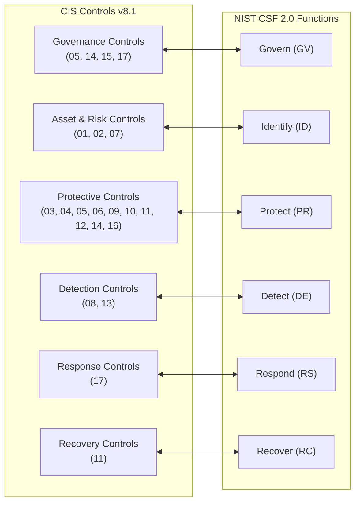

# CIS Critical Security Controls v8.1

## Purpose

Operational reference for CIS Critical Security Controls Version 8.1, providing prioritized, prescriptive cybersecurity safeguards mapped to implementation groups, asset classes, and security functions.

## Upstream

- Official Portal: <https://www.cisecurity.org/controls/v8-1>
- CIS Controls Navigator: <https://www.cisecurity.org/controls/cis-controls-navigator>
- Release Date: June 2024

## Structure & Architecture

CIS Controls v8.1 organizes defensive cybersecurity capabilities into **18 Controls** containing **153 Safeguards** (formerly known as sub-controls).

### Implementation Groups (IGs)

The framework prioritizes safeguard adoption through three tiered Implementation Groups based on organizational risk profile and resources:

| Group | Title | Total Safeguards | Scope & Target Audience |
| --- | --- | --- | --- |
| **IG1** | Essential Cyber Hygiene | 56 | Foundational defense for all organizations against widespread, non-targeted commodity attacks. Recommended baseline. |
| **IG2** | Enterprise Defense | 130 (cumulative) | Organizations managing enterprise complexity with dedicated IT and security personnel. |
| **IG3** | Advanced / High-Risk | 153 (cumulative) | Organizations handling sensitive data, critical infrastructure, or defending against targeted APT adversaries. |

### Key Updates in Version 8.1

1. **Govern Security Function:** Added **Govern** as a formal Security Function alongside Identify, Protect, Detect, Respond, and Recover to align directly with **NIST CSF 2.0**.
2. **Safeguard Clarifications:** Refined descriptions, scope conditions, and measurability for multiple safeguards without disrupting the 18-control structure.
3. **Asset Class Refinements:** Standardized mapping across Applications, Data, Devices, Network, and Users.
4. **Expanded Glossary:** Defined prescriptive terminology (e.g., plan, process, sensitive data, enterprise assets).

---

## The 18 CIS Controls

| # | Control Name | Asset Class | Total Safeguards | IG1 | IG2 | IG3 |
|---|---|---|---|---|---|---|
| **01** | Inventory and Control of Enterprise Assets | Devices | 5 | 2 | 4 | 5 |
| **02** | Inventory and Control of Software Assets | Applications | 7 | 3 | 6 | 7 |
| **03** | Data Protection | Data | 14 | 6 | 12 | 14 |
| **04** | Secure Configuration of Enterprise Assets & Software | Devices, Applications | 12 | 7 | 11 | 12 |
| **05** | Account Management | Users | 6 | 4 | 6 | 6 |
| **06** | Access Control Management | Users, Data, Devices | 8 | 5 | 8 | 8 |
| **07** | Continuous Vulnerability Management | Applications, Devices | 7 | 4 | 7 | 7 |
| **08** | Audit Log Management | Network, Devices, Apps | 12 | 3 | 11 | 12 |
| **09** | Email and Web Browser Protections | Applications, Users | 7 | 2 | 7 | 7 |
| **10** | Malware Defenses | Devices, Applications | 7 | 3 | 7 | 7 |
| **11** | Data Recovery | Data | 5 | 4 | 5 | 5 |
| **12** | Network Infrastructure Management | Network | 8 | 1 | 7 | 8 |
| **13** | Network Monitoring and Defense | Network | 11 | 0 | 7 | 11 |
| **14** | Security Awareness and Skills Training | Users | 9 | 8 | 9 | 9 |
| **15** | Service Provider Management | Users, Data, Apps | 7 | 1 | 6 | 7 |
| **16** | Application Software Security | Applications | 14 | 1 | 11 | 14 |
| **17** | Incident Response Management | Users, Devices, Net | 9 | 3 | 8 | 9 |
| **18** | Penetration Testing | Net, Devices, Apps | 5 | 0 | 3 | 5 |
| **Total** | | | **153** | **56** | **130** | **153** |

---

## Alignment with NIST CSF 2.0

## Machine Catalog

Compact machine-readable definitions and safeguard distributions are indexed in:
- [`catalogs/cis-v8.1-controls.json`](./catalogs/cis-v8.1-controls.json)

## Advisory

Center for Internet Security (CIS) materials are copyright Center for Internet Security. Advisory reference only.
