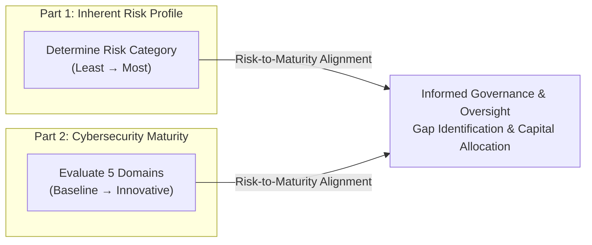
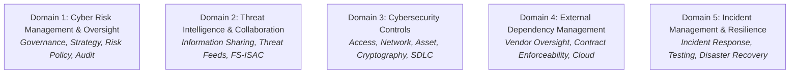

# FFIEC Cybersecurity Assessment Tool (CAT) & Banking Guidance

## Purpose

Operational reference for the Federal Financial Institutions Examination Council (FFIEC) Cybersecurity Assessment Tool (CAT) and IT Examination Handbook, providing structured risk profiling and cybersecurity maturity benchmarks for depository institutions, banks, credit unions, and financial service providers.

## Upstream & Authority

- Primary Authority: Federal Financial Institutions Examination Council (FFIEC)
- Member Agencies:
  - Board of Governors of the Federal Reserve System (FRB)
  - Federal Deposit Insurance Corporation (FDIC)
  - National Credit Union Administration (NCUA)
  - Office of the Comptroller of the Currency (OCC)
  - Consumer Financial Protection Bureau (CFPB)
  - State Liaison Committee (SLC)
- Core Publications: FFIEC Cybersecurity Assessment Tool (CAT), FFIEC IT Examination Handbook Series (Information Security, Architecture Infrastructure & Operations, Business Continuity, Outsourcing Technology Services).

---

## Two-Part Assessment Architecture

The FFIEC CAT provides a repeatable, objective mechanism to evaluate an institution's cybersecurity posture by comparing its **Inherent Risk Profile** against its **Cybersecurity Maturity**:

---

## Part 1: Inherent Risk Profile

Inherent risk evaluates risk level without considering compensating internal controls. Evaluated across 5 distinct risk categories:

| Risk Category | Key Assessment Activities & Indicators | Risk Levels |
| --- | --- | --- |
| **1. Technologies & Connection Types** | Total number of internet connections, wireless networks, third-party hosting connections, cloud providers (IaaS/PaaS/SaaS), and end-of-life (EOL) systems. | Least, Minimal, Moderate, Significant, Most |
| **2. Delivery Channels** | Availability of web/mobile banking, ATMs, call centers, payment clearing interfaces, and API integrations for customer transactions. | Least, Minimal, Moderate, Significant, Most |
| **3. Online/Mobile Products & Services** | Wire transfers, ACH origination, merchant acquiring, person-to-person (P2P) transfers, treasury management, and remote deposit capture. | Least, Minimal, Moderate, Significant, Most |
| **4. Organizational Characteristics** | Total asset size, number of employees, geographic footprint, M&A history, changes in IT staff, and technology outsourcing footprint. | Least, Minimal, Moderate, Significant, Most |
| **5. External Threats** | Volume, frequency, and sophistication of targeted attacks (DDoS, credential stuffing, ransomware attempts, phishing campaigns). | Least, Minimal, Moderate, Significant, Most |

---

## Part 2: Cybersecurity Maturity (5 Domains)

Maturity is measured across 5 Domains, each containing multiple assessment factors and declarative statements across 5 progressive levels:

### Maturity Levels
1. **Baseline:** Minimum expectations required by legal and regulatory requirements (mandatory starting point for all institutions).
2. **Evolving:** Additional controls beyond baseline; documented procedures, formal risk ownership, and enhanced monitoring.
3. **Intermediate:** Detailed risk governance, automated control enforcement, threat-informed risk assessment, and integrated resilience.
4. **Advanced:** Proactive, predictive defense mechanisms, automated orchestration, integrated tabletop exercises, and red-team simulations.
5. **Innovative:** Real-time adaptive controls, advanced analytics/AI defense, continuous industry threat sharing, and automated self-healing infrastructure.

---

### The 5 Maturity Domains

#### Domain 1: Cyber Risk Management & Oversight
- Governance structure, Board of Directors oversight, and management reporting cadence.
- Risk management culture, policies, risk appetite statements, and independent cybersecurity audit functions.

#### Domain 2: Threat Intelligence & Collaboration
- Threat intelligence ingestion and active participation in information-sharing forums (e.g., **FS-ISAC** - Financial Services Information Sharing and Analysis Center).
- Automated integration of Indicators of Compromise (IOCs) into security monitoring tools.

#### Domain 3: Cybersecurity Controls
- Logical access control, MFA, principle of least privilege, and network segmentation.
- Vulnerability scanning, automated patch management, data loss prevention (DLP), and cryptographic protection for data in transit/at rest.

#### Domain 4: External Dependency Management
- Third-party risk management (TPRM) programs, vendor due diligence, SOC report evaluations, and continuous vendor monitoring.
- Contractual terms enforcing audit rights, security standards, and mandatory breach notification timelines.

#### Domain 5: Cyber Incident Management & Resilience
- Incident response planning, escalation trees, forensic readiness, and public relations coordination.
- Business continuity planning (BCP), disaster recovery (DR) testing, and resilience under ransomware and destructive cyberattacks.

---

## Inherent Risk vs. Expected Maturity Matrix

Institutions must achieve cybersecurity maturity levels aligned with their inherent risk tier:

| Inherent Risk Profile | Minimum Expected Maturity Target |
| --- | --- |
| **Least** | Baseline across all 5 domains |
| **Minimal** | Baseline (transitioning to Evolving in critical areas) |
| **Moderate** | Evolving to Intermediate |
| **Significant** | Intermediate to Advanced |
| **Most** | Advanced to Innovative |

---

## Operational Takeaways for Cloud & Modern FinTech

1. **Third-Party Dependency Scrutiny:** Cloud-hosted core banking and microservices architectures require rigorous Domain 4 assessment, validating shared responsibility models.
2. **FS-ISAC Integration:** Examination standards heavily favor institutions that actively consume and share threat data within the financial community.
3. **Cumulative Assessment Rule:** To achieve a higher maturity level (e.g., Intermediate), an institution must satisfy **100%** of all declarative statements in the preceding levels (Baseline and Evolving) within that factor.
