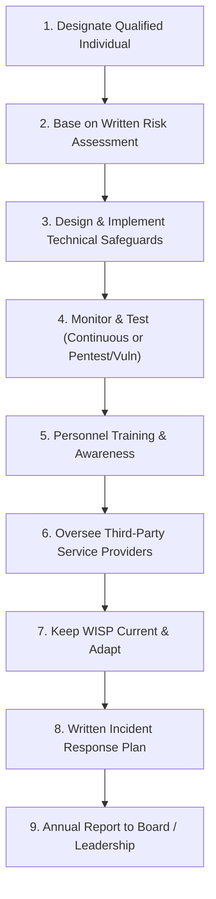

# Gramm-Leach-Bliley Act (GLBA) & FTC Safeguards Rule

## Purpose

Operational reference for the Gramm-Leach-Bliley Act (GLBA) of 1999 and the Federal Trade Commission's (FTC) revised **Standards for Safeguarding Customer Information (16 CFR Part 314)**, governing technical, administrative, and physical safeguards for protecting Nonpublic Personal Information (NPI).

## Upstream & Authority

- Statutory Authority: 15 U.S.C. Subchapter I, Chapter 94 (§§ 6801–6809)
- Primary Enforcement: Federal Trade Commission (FTC), CFPB, FDIC, OCC, Federal Reserve, NCUA, and state attorneys general
- Regulatory Rules:
  - **FTC Safeguards Rule:** 16 CFR Part 314 (Amended 2021; Mandatory enforcement June 9, 2023)
  - **FTC Breach Notification Amendment:** 16 CFR § 314.4(j) (Effective May 13, 2024)
  - **FTC Privacy Rule:** 16 CFR Part 313 (Privacy notices and opt-out rights)

---

## Scope & Nonpublic Personal Information (NPI)

### Covered Financial Institutions
Applies broadly to non-banking entities significantly engaged in financial activities:
- Mortgage lenders, brokers, and servicers
- Payday lenders, finance companies, and check cashers
- Auto dealerships engaged in financing or leasing
- Collection agencies, credit reporting agencies, and tax preparation services
- Real estate appraisers and personal property appraisers
- Investment advisors not registered with the SEC and fintech loan platforms

### Nonpublic Personal Information (NPI) Definition
Any personally identifiable financial information that a financial institution collects about an individual in connection with providing a financial product or service:
- Names, SSNs, financial account numbers, credit scores, transaction histories.
- Any list, description, or grouping of consumers derived using personally identifiable financial information.
- Excludes publicly available information (unless grouped with or derived from NPI).

---

## The 9 Core Safeguard Requirements (16 CFR § 314.4)

Covered financial institutions must develop, implement, and maintain a comprehensive **Written Information Security Program (WISP)** satisfying 9 core elements:

### 1. Designate a Qualified Individual (§ 314.4(a))
Designate a single qualified individual (e.g., CISO or senior security leader; may be employed by an external Managed Security Service Provider) responsible for overseeing, implementing, and enforcing the WISP.

### 2. Base on Written Risk Assessment (§ 314.4(b))
Perform a formal written risk assessment identifying reasonably foreseeable internal and external risks to the security, confidentiality, and integrity of customer information. Must define criteria for evaluating and categorizing risks and assessing control adequacy.

### 3. Design and Implement Specific Technical Safeguards (§ 314.4(c))
- **Access Controls (§ 314.4(c)(1)):** Place access controls on customer information systems and authenticate authorized users based on least privilege and need-to-know.
- **Data Inventory & Mapping (§ 314.4(c)(2)):** Identify and manage the data, personnel, devices, systems, and facilities that enable the organization to achieve business purposes.
- **Encryption of NPI (§ 314.4(c)(3)):** Encrypt all customer information in transit over public networks and at rest. If encryption is infeasible, the Qualified Individual must approve effective compensating controls in writing.
- **Secure Development Practices (§ 314.4(c)(4)):** Adopt secure development practices for in-house applications and procedures for evaluating third-party software.
- **Multi-Factor Authentication (MFA) (§ 314.4(c)(5)):** Implement mandatory MFA for **any individual** accessing any information system that contains or processes customer information (unless the Qualified Individual has approved equivalent controls in writing).
- **Secure Disposal (§ 314.4(c)(6)):** Securely dispose of customer information no later than two years after the last date the information is used, unless retention is required for legal/business purposes.
- **Change Management (§ 314.4(c)(7)):** Adopt formal change management procedures for systems and environments.
- **Logging & Monitoring (§ 314.4(c)(8)):** Implement policies and procedures to monitor and log unauthorized access, use, or tampering with customer information.

### 4. Regularly Monitor and Test Effectiveness (§ 314.4(d))
Regularly test or monitor the effectiveness of safeguards through either:
- **Continuous Monitoring:** Real-time monitoring of systems, endpoint detection, and continuous automated vulnerability scanning; **OR**
- **Periodic Testing:** Annual penetration testing **plus** bi-annual vulnerability assessments.

### 5. Staff Training & Verification (§ 314.4(e))
Provide staff with security awareness training updated to reflect new risks, verify that security personnel maintain current cybersecurity knowledge, and test personnel via simulations (e.g., phishing drills).

### 6. Service Provider Oversight (§ 314.4(f))
- Exercise due diligence when selecting third-party service providers.
- Mandate contractual requirements that service providers implement and maintain adequate safeguards.
- Periodically assess service providers based on the risk they present.

### 7. Evaluation and Program Adjustments (§ 314.4(g))
Continually evaluate and adjust the information security program in light of testing results, material business changes, or emerging threats.

### 8. Written Incident Response Plan (§ 314.4(h))
Establish a formal written incident response plan (IRP) designed to promptly respond to, and recover from, any security event affecting customer information. Must define roles, internal processes, external communications, remediation tracking, and post-incident reviews.

### 9. Written Annual Report to the Board (§ 314.4(i))
The Qualified Individual must report in writing, at least annually, to the Board of Directors or senior governing body detailing the overall status of the WISP, compliance posture, material risk assessments, service provider management, and security event summaries.

---

## Mandatory FTC Breach Notification Rule (§ 314.4(j))

Effective **May 13, 2024**, financial institutions must notify the FTC of a **notification event**:
- **Trigger:** Unauthorized acquisition of unencrypted customer information involving at least **500 consumers**.
- **Timing:** Mandatory reporting to the FTC via its online reporting portal no later than **30 days** after discovery.
- **Required Details:** Entity name and contact info, description of event, date range of event, number of affected consumers, and whether law enforcement requested a delay.

---

## Small Institution Exemption (§ 314.6)

Financial institutions maintaining customer information for fewer than **5,000 consumers** are exempt from:
- Written risk assessment requirement (§ 314.4(b))
- Continuous monitoring or annual pentest / bi-annual vuln scans (§ 314.4(d)(2))
- Written incident response plan (§ 314.4(h))
- Written annual report to the Board of Directors (§ 314.4(i))

*Note: All other requirements (including MFA, encryption, access controls, and Qualified Individual oversight) remain fully mandatory.*

---

## Common Compliance Gotchas

1. **Missing MFA on Cloud SaaS:** Failing to enforce MFA on email, CRM, or file-sharing platforms containing customer NPI.
2. **Failure to Maintain Written Risk Assessments:** Relying on informal threat discussions rather than structured, documented risk matrices signed by the Qualified Individual.
3. **Vendor Contract Deficiencies:** Engaging software vendors or MSPs without explicit contractual clauses requiring them to maintain GLBA-compliant safeguards.
4. **Neglecting the 30-Day Notification Clock:** Delaying forensic analysis past the 30-day reporting threshold for events affecting 500+ consumers.
