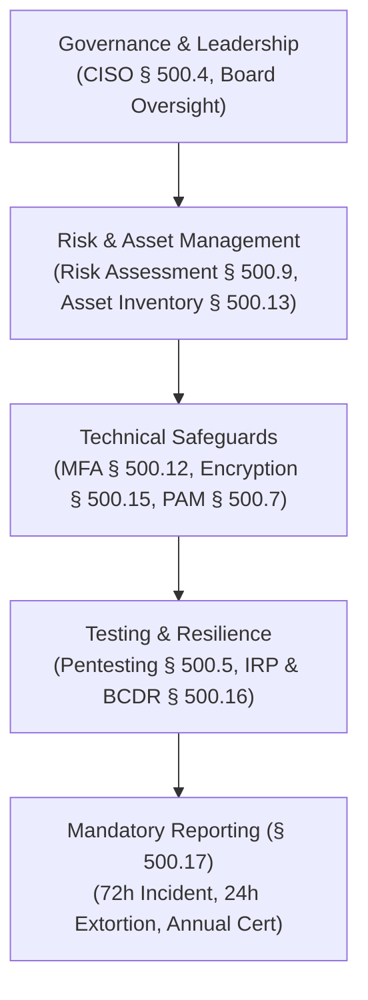

# NYDFS Cybersecurity Regulation (23 NYCRR 500)

## Purpose

Operational reference for the New York State Department of Financial Services (NYDFS) Cybersecurity Requirements for Financial Services Companies (23 NYCRR 500), including the landmark Second Amendment strengthening board oversight, access controls, incident notification, and Class A company obligations.

## Upstream & Authority

- Primary Authority: New York State Department of Financial Services (NYDFS)
- Regulation: Title 23 of the Official Compilation of Codes, Rules and Regulations of the State of New York (23 NYCRR Part 500)
- Revision Status: Second Amendment adopted November 2023 with phased enforcement across 2024, 2025, and 2026.
- Scope: Any person or entity operating under or required to operate under a license, registration, charter, certificate, permit, accreditation, or similar authorization under NY Banking, Insurance, or Financial Services Laws.

---

## Entity Categorization & Class A Companies

The regulation establishes tiered obligations based on organizational size:

### Class A Companies Definition (§ 500.1(d))
A covered entity with at least **$20,000,000** in gross annual revenue in each of the last two fiscal years from all business operations of the covered entity and its affiliates, AND:
1. An average of at least **2,000 employees** over the last two fiscal years (including affiliates); **OR**
2. At least **$1,000,000,000** in gross annual revenue in each of the last two fiscal years from all operations (including affiliates).

### Heightened Class A Obligations
- **Independent Audits (§ 500.2(c)):** Conduct independent cybersecurity audits at least annually.
- **Privileged Access Management (§ 500.7):** Implement automated privileged access management (PAM) solutions and centralized logging.
- **Endpoint Detection & Response (EDR) (§ 500.5(b)):** Deploy EDR solutions across all enterprise endpoints and centralize log aggregation.
- **External Risk Experts:** Retain external experts to conduct risk assessments at least once every three years.

---

## Core Regulatory Requirements

### 1. Governance & Leadership (§ 500.4)
- **CISO Mandate:** Designate a qualified Chief Information Security Officer (CISO) who must report in writing at least annually to the Board of Directors on the cybersecurity program and material risks.
- **Board Oversight:** The Board of Directors (or committee) must exercise active oversight of cybersecurity risk, possess adequate cybersecurity expertise, and review regular executive reports.

### 2. Multi-Factor Authentication (MFA) (§ 500.12)
MFA is strictly mandatory for:
- Remote access to the covered entity's information systems or nonpublic information (NPI).
- Remote access to third-party applications (including email/SaaS) from which NPI is accessible.
- All privileged access to information systems.
*(Compensating controls are only permitted if approved annually in writing by the CISO with rigorous technical justification).*

### 3. Asset Management & Data Retention (§ 500.13)
- Maintain an accurate, documented inventory of all hardware, operating systems, applications, APIs, and cloud services.
- Establish data retention policies requiring non-retention of NPI when no longer necessary for business operations, except where retention is legally mandated.

### 4. Vulnerability Management & Testing (§ 500.5)
- Conduct annual penetration testing by a qualified internal or external party.
- Implement automated vulnerability scanning, prioritized patching based on risk, and continuous monitoring.

### 5. Incident Response & Business Continuity (§ 500.16)
- Maintain a written Incident Response Plan (IRP) and Business Continuity & Disaster Recovery (BCDR) plan.
- Conduct annual tabletop testing of the IRP and BCDR plan with senior leadership and key stakeholders.
- Maintain isolated, secure backups that are tested regularly to ensure rapid recovery from ransomware.

---

## Mandatory Notification Triggers (§ 500.17)

| Reporting Obligation | Trigger Event | Mandatory Reporting Deadline | Recipient |
| --- | --- | --- | --- |
| **Cybersecurity Incident Notification** (§ 500.17(a)) | A cybersecurity event that has occurred at the covered entity, an affiliate, or a third-party service provider that: (1) requires notice to any government/regulatory body, OR (2) has a reasonable likelihood of materially harming normal operations. | **Within 72 hours** of determination that a cybersecurity event has occurred. | NYDFS Superintendent via online portal |
| **Extortion Payment Notification** (§ 500.17(c)(1)) | Making an extortion / ransomware payment. | **Within 24 hours** of making the payment. | NYDFS Superintendent |
| **Extortion Justification Report** (§ 500.17(c)(2)) | Full written explanation of why payment was necessary, alternatives considered, sanctions diligence, and safeguards adopted. | **Within 30 days** of payment. | NYDFS Superintendent |
| **Annual Compliance Certification** (§ 500.17(b)) | Formal electronic certification of material compliance (or acknowledgment of non-compliance with remediation plan) signed by CISO and highest-ranking executive. | **Annually by April 15** | NYDFS Superintendent |

---

## Limited Exemptions (§ 500.19)

Small businesses qualifying under § 500.19(a) (fewer than 20 employees, less than $5M gross annual revenue from NY operations in last 3 years, or less than $15M in year-end total assets) are exempt from certain sections (e.g., formal CISO, independent audit, full BCDR testing), but **MUST** still comply with:
- Core cybersecurity policy (§ 500.3)
- Access controls and mandatory MFA (§ 500.12)
- Incident response and 72-hour reporting (§ 500.17)
- Annual compliance certification (§ 500.17(b))
