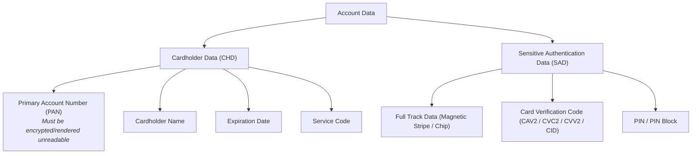

# PCI Data Security Standard (PCI DSS) v4.0.1

## Purpose

Operational reference for the Payment Card Industry Data Security Standard (PCI DSS) Version 4.0.1, governing technical and operational controls for organizations that store, process, or transmit Account Data (Cardholder Data and Sensitive Authentication Data).

## Upstream & Authority

- Primary Authority: Payment Card Industry Security Standards Council (PCI SSC)
- Founding Brands: American Express, Discover, JCB International, MasterCard, Visa
- Current Standard: PCI DSS v4.0.1 (Published June 2024; v3.2.1 retired March 31, 2024)
- Full Mandatory Enforcement: March 31, 2025 (all future-dated requirements become mandatory)

---

## Account Data Architecture

PCI DSS strictly distinguishes between **Cardholder Data (CHD)** and **Sensitive Authentication Data (SAD)**:

> [!CAUTION]
> **SAD Storage Rule:** Sensitive Authentication Data (SAD) **MUST NOT** be stored after transaction authorization, even if encrypted. Only issuers and payment processors with a justified business need may retain SAD prior to authorization.

---

## The 6 Goals & 12 Principal Requirements

| Goal | Requirement # | Requirement Title | Core Technical Mandate |
| --- | --- | --- | --- |
| **Build and Maintain a Secure Network and Systems** | **1** | Install and maintain network security controls | Manage firewalls, cloud security groups, network segmentation, and inbound/outbound traffic rules isolating the CDE. |
| | **2** | Apply secure configurations to all system components | Eliminate default passwords, harden OS/cloud images, disable unnecessary services/ports, and manage system assets. |
| **Protect Account Data** | **3** | Protect stored account data | Render PAN unreadable anywhere it is stored (AES-256, hashing, tokenization); never store SAD post-authorization; manage cryptographic keys securely. |
| | **4** | Protect cardholder data with strong cryptography during transmission | Mandate modern TLS (TLS 1.2+ / TLS 1.3) with strong cipher suites across open, public networks and untrusted internal networks. |
| **Maintain a Vulnerability Management Program** | **5** | Protect all systems and networks from malicious software | Deploy and maintain anti-malware solutions, perform continuous behavioral scans, and prevent phishing/malware attacks. |
| | **6** | Develop and maintain secure systems and software | Maintain secure SDLC, patch critical vulnerabilities within 30 days of release, prevent OWASP Top 10 vulnerabilities, and govern payment page scripts (**Req 6.4.3**). |
| **Implement Strong Access Control Measures** | **7** | Restrict access to system components and data by business need to know | Enforce strict Role-Based Access Control (RBAC) and least privilege principles across all CDE components. |
| | **8** | Identify users and authenticate access to system components | Mandate unique IDs, strong authentication, and Multi-Factor Authentication (MFA) for **all** access into the CDE (**Req 8.4.2**). |
| | **9** | Restrict physical access to cardholder data | Restrict physical facility access, manage visitor logs, and physically protect media, drives, and POS/POI devices from tampering. |
| **Regularly Monitor and Test Networks** | **10** | Log and monitor all access to system components and cardholder data | Maintain comprehensive audit trails, synchronize system clocks (NTP), review audit logs daily, and retain log history for at least 1 year (3 months immediately available). |
| | **11** | Test security of systems and networks regularly | Perform quarterly internal/external ASV vulnerability scans, annual penetration testing (internal & external), deploy file integrity monitoring (FIM), and tamper detection for payment pages (**Req 11.6.1**). |
| **Maintain an Information Security Policy** | **12** | Support information security with organizational policies and programs | Maintain comprehensive infosec policies, conduct annual risk assessments, establish security awareness training, oversee third-party service providers (TPSPs), and maintain an incident response plan. |

---

## Key Technical Additions in PCI DSS v4.x

1. **Client-Side Payment Page Script Governance (Req 6.4.3):**
   - Mandates a method to confirm that all JavaScript loaded and executed in the consumer's browser on payment pages is authorized and tamper-free (e.g., Subresource Integrity hashes, Content Security Policy headers, script inventory).
2. **Multi-Factor Authentication Everywhere (Req 8.4.2 & 8.4.3):**
   - MFA is required for *all* non-console access into the Cardholder Data Environment (CDE), not just remote administrative access.
3. **Payment Page Tamper Detection (Req 11.6.1):**
   - Deploy change- and tamper-detection mechanisms (such as CSP violation reporting, synthetic monitoring, or client-side integrity tools) to alert on unauthorized modifications to HTTP headers and payment pages at least once every seven days or periodically.
4. **Targeted Risk Analysis (TRA):**
   - For flexible requirements, entities must document a formal Targeted Risk Analysis justifying defined frequencies (e.g., log review cadences, scan intervals).

---

## Validation Paths: Defined vs. Customized Approach

PCI DSS v4.x introduces two distinct methods for validating requirements:

- **Defined Approach:** Traditional validation path. The entity implements the requirement exactly as stated in the standard; the Qualified Security Assessor (QSA) verifies compliance against the standard's Defined Testing Procedures.
- **Customized Approach:** Risk-based validation path designed for mature, innovative security architectures. The entity designs its own custom security controls to meet the requirement's **Customized Approach Objective**, performs a formal Targeted Risk Analysis (TRA), and the assessor develops customized testing procedures to validate effectiveness.

---

## Scoping & Self-Assessment Questionnaire (SAQ) Types

| SAQ Type | Merchant Architecture & Eligible Processing Model |
| --- | --- |
| **SAQ A** | Card-not-present (e-commerce / mail order) merchants that fully outsource all cardholder data functions to PCI DSS compliant third parties (e.g., iframe or hosted payment page redirect). Zero local CHD storage, processing, or transmission. |
| **SAQ A-EP** | E-commerce merchants that host their own website/checkout pages but use direct API calls or script integrations to transmit card data directly from consumer browser to payment processor. |
| **SAQ B** | Merchants using standalone, dial-out or physical terminals with no electronic cardholder data storage. |
| **SAQ B-IP** | Merchants using standalone PTS-approved point-of-interaction (POI) devices with IP connections to payment processor. |
| **SAQ C** | Merchants with payment application systems connected to the internet, no electronic cardholder data storage. |
| **SAQ C-VT** | Merchants who manually enter transactions one-by-one via an online virtual terminal. |
| **SAQ P2PE** | Merchants using validated Point-to-Point Encryption (P2PE) hardware solutions with no electronic storage of cardholder data. |
| **SAQ D** | **SAQ D for Merchants:** All other merchants not meeting above criteria, or who store cardholder data. **SAQ D for Service Providers:** All service providers defined by payment brands as eligible for SAQ validation. |
| **ROC** | **Report on Compliance:** Mandatory onsite audit by a Qualified Security Assessor (QSA) for Level 1 merchants (>6 million transactions/year) and Level 1 service providers. |

---

## Common Compliance Gotchas

1. **Unscoped Flat Networks:** Failing to implement firewall or VLAN network segmentation, which causes the entire enterprise IT environment to fall within the audit scope of the CDE.
2. **Unencrypted PAN in Log Files / Core Dumps:** Debug logging and error tracing capturing raw payment payloads containing unmasked 16-digit PANs.
3. **Third-Party Script Injection (Magecart Attacks):** Failing to govern marketing, analytics, or chat scripts loaded dynamically onto checkout pages without SRI or CSP restrictions.
4. **Missing Service Provider Responsibility Matrices:** Failing to maintain formal written agreements and a Responsibility Matrix (Req 12.8) outlining exact PCI DSS controls managed by cloud providers (AWS, Azure, GCP) vs. the merchant.
