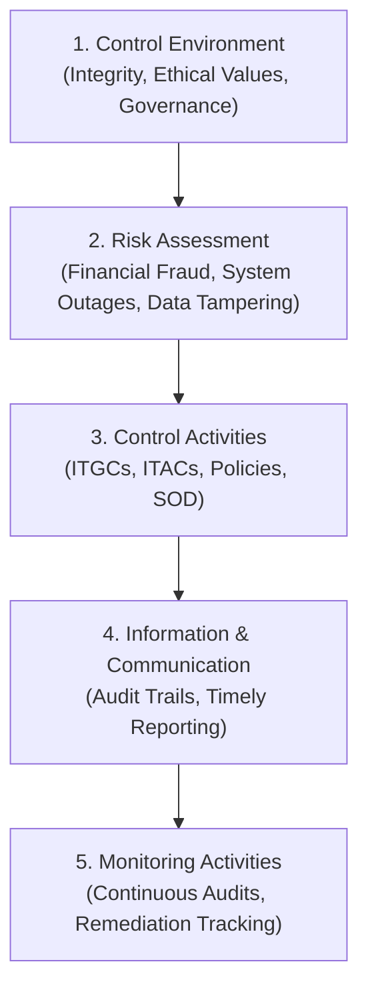

# Sarbanes-Oxley Act (SOX) & IT General Controls (ITGC)

## Purpose

Operational reference for the Sarbanes-Oxley Act of 2002 (SOX), specifically IT General Controls (ITGC) and IT Application Controls (ITAC) supporting Internal Control over Financial Reporting (ICFR) under SEC rules, COSO 2013 framework, and PCAOB auditing standards.

## Upstream & Authority

- Primary Authority: US Securities and Exchange Commission (SEC) & Public Company Accounting Oversight Board (PCAOB)
- Standard Framework: COSO 2013 Internal Control — Integrated Framework
- Auditing Standard: PCAOB AS 2201 (*An Audit of Internal Control Over Financial Reporting That Is Integrated with An Audit of Financial Statements*)
- Statutory Mandates: SOX Section 302 (Corporate Responsibility for Financial Reports) & Section 404 (Management Assessment of Internal Controls)

---

## Core Statutory Requirements

| Section | Target Audience | Mandate | IT Implication |
| --- | --- | --- | --- |
| **Section 302** | CEO / CFO Certification | Personal certification of quarterly/annual financial report accuracy, disclosure controls, and internal control effectiveness. | Executives rely on automated reporting logic, data pipelines, and IT safeguards preventing unauthorized transaction modification. |
| **Section 404(a)** | Corporate Management | Annual report on management's responsibility for establishing and maintaining adequate ICFR and assessment of ICFR effectiveness. | Documentation and testing of ITGC controls governing financial ledger software, databases, infrastructure, and access pathways. |
| **Section 404(b)** | Independent Registered Auditor | Independent attestation and audit report on management's assessment of internal controls. | Direct auditor inspection of change logs, ticket approvals, user access lists, SOD matrices, and batch job error logs. |

---

## COSO 2013 Alignment

SOX compliance standardizes on the **Committee of Sponsoring Organizations of the Treadway Commission (COSO) 2013** internal control framework:

Key IT-governing COSO principles:
- **Principle 11 (General Controls over Technology):** Design and implement general control activities over technology infrastructure, security management, and software development/acquisition.
- **Principle 12 (Policies and Procedures):** Establish control activities through clear policies and operational procedures.
- **Principle 13 (Quality Information):** Ensure IT systems produce timely, accurate, and complete information for financial decisions.

---

## IT General Controls (ITGC) Domains

ITGCs ensure the integrity, availability, and security of operating systems, databases, networks, and applications supporting financial reporting systems (e.g., ERPs like SAP, Oracle, NetSuite, and billing engines).

### 1. Logical Access & Identity Management
- **User Provisioning & Role-Based Access Control (RBAC):** Formal, documented approval process required prior to granting access to financial applications or databases.
- **Deprovisioning / Termination Cadence:** Automated or SLA-enforced revoking of logical access upon employee termination (typically within 24 hours).
- **Periodic User Access Reviews (UAR):** Quarterly or bi-annual recertification by business process owners and system owners of all active accounts and elevated privileges.
- **Privileged Access Management (PAM):** Strict restriction and vaulting of superuser/admin credentials (root, DBA, admin roles); session logging and just-in-time access.
- **Segregation of Duties (SOD):** Enforcement of preventive conflict matrices (e.g., preventing a single individual from authoring code and deploying to production, or creating vendor records and approving disbursement payments).
- **Authentication Safeguards:** Mandatory Multi-Factor Authentication (MFA), strict password length/complexity, and account lockout policies.

### 2. Change Management & Software Development Lifecycle (SDLC)
- **Change Authorization & Ticket Traceability:** Every change to financial applications, schemas, or batch jobs requires an approved change ticket linked to business justification.
- **Testing & Staging Isolation:** Mandatory testing in segregated non-production environments with documented test results and stakeholder sign-off prior to release.
- **Deployment Separation:** Strict segregation ensuring developers do not have write or deployment permissions to production environments (automated CI/CD pipelines with branch protection and dual-approver rules).
- **Emergency / Hotfix Controls:** Documented retrospective approval process for emergency production fixes, including post-deployment audit log reviews.

### 3. System Operations & Data Resilience
- **Job Scheduling & Batch Processing Monitoring:** Automated monitoring and alerting for critical batch runs (e.g., general ledger reconciliation, payroll processing), with documented error resolution protocols.
- **Backup & Recovery Verification:** Automated daily/incremental backups of financial databases, encrypted storage, and documented periodic test restorations (at least annually).
- **Disaster Recovery (DR) & Business Continuity:** Formal DR plans with validated Recovery Time Objectives (RTO) and Recovery Point Objectives (RPO) tested against simulated disaster scenarios.
- **Incident Management & Root-Cause Analysis:** Formal ticketing, escalation, and post-mortem procedures for system outages, data corruption, or security incidents impacting financial systems.

### 4. IT Application Controls (ITAC)
- **Input Validation:** Automated boundary checks, format validations, and duplicate transaction detection.
- **Processing Integrity:** Checksums, automated ledger reconciliation, and balancing controls between sub-ledgers and the general ledger.
- **Output Controls & Interface Reconciliation:** Verification of data transmissions between integrated systems (e.g., e-commerce billing gateway to ERP general ledger) via hash validation and transmission audit logs.

---

## Deficiency Classification Hierarchy

Under PCAOB AS 2201, deficiencies discovered during ITGC/ICFR testing are classified by severity:

| Deficiency Level | Definition | SEC / Board Reporting Requirement |
| --- | --- | --- |
| **Control Deficiency** | Design or operation of a control does not allow management or employees to prevent or detect misstatements on a timely basis. | Internal management tracking and remediation. |
| **Significant Deficiency** | A deficiency, or combination of deficiencies, in ICFR that is less severe than a material weakness yet important enough to merit attention by those charged with oversight. | Mandatory formal communication to the Audit Committee and external auditor. |
| **Material Weakness** | A deficiency, or combination of deficiencies, in ICFR such that there is a **reasonable possibility that a material misstatement** of financial statements will not be prevented or detected on a timely basis. | **Adverse audit opinion on ICFR**, public disclosure in Form 10-K / 10-Q SEC filings. |

---

## Audit Gotchas & Operational Pitfalls

1. **Shared Administrator Accounts:** Using shared generic credentials (`admin`, `root`, `sa`) prevents non-repudiation and immediately triggers audit findings.
2. **Untracked Direct Database Edits:** Executing direct SQL update/delete queries against production financial databases without a logged, pre-approved change ticket.
3. **Incomplete User Access Reviews:** Conducting "rubber stamp" access reviews where managers approve bulk access lists without validating least-privilege or terminated employees.
4. **Developer Access to Production CI/CD:** Developers possessing permissions to bypass pull request rules or directly commit/deploy to production branches.
