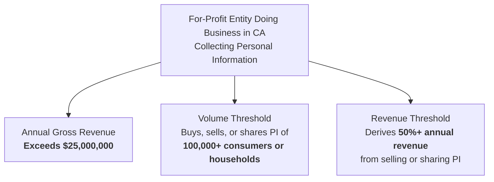
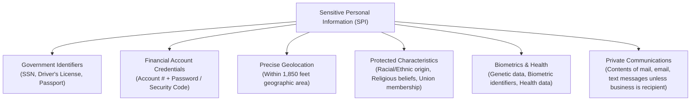

# California Consumer Privacy Act (CCPA) & CPRA

## Purpose

Operational reference for the California Consumer Privacy Act (CCPA), as amended by the California Privacy Rights Act (CPRA) (Cal. Civ. Code § 1798.100 *et seq.*), governing consumer privacy rights, corporate data transparency, sensitive data restrictions, and automated opt-out mechanisms.

## Upstream & Authority

- Primary Regulatory Agency: California Privacy Protection Agency (CPPA) & Office of the California Attorney General
- Statutory Codification: California Civil Code Title 1.81.5 (§§ 1798.100–1798.199.100)
- Regulatory Regulations: 11 CCR §§ 7000–7304
- Enforcement Status: Active civil enforcement by CPPA and Attorney General.

---

## Business Applicability Thresholds

Applies to for-profit entities doing business in California that collect California residents' personal information and satisfy at least **one** of the following:

---

## Core Consumer Rights

| Consumer Right | Statutory Citation | Operational Engineering Mandate |
| --- | --- | --- |
| **Right to Know / Access** | § 1798.110 | Disclose categories and specific pieces of PI collected, sources, business purposes, and categories of third parties with whom data is shared. |
| **Right to Delete** | § 1798.105 | Permanently delete consumer personal information across internal systems and direct service providers/contractors to delete. |
| **Right to Correct** | § 1798.106 | Correct inaccurate personal information maintained about the consumer across databases upon verified request. |
| **Right to Opt-Out of Sale / Sharing** | § 1798.120 | Cease "selling" or "sharing" personal information (including cross-context behavioral advertising / retargeting pixels). |
| **Right to Limit Use of Sensitive PI (SPI)** | § 1798.121 | Limit processing of Sensitive Personal Information only to services strictly necessary to deliver requested products. |
| **Right to Non-Discrimination** | § 1798.125 | Prohibit denying goods, charging differential pricing, or degrading service quality for consumers exercising privacy rights. |

---

## Sensitive Personal Information (SPI) Classification

The CPRA created a heightened subcategory of data—**Sensitive Personal Information (SPI)**—requiring explicit use restrictions:

> [!IMPORTANT]
> **SPI Restriction Mandate:** If an entity uses SPI for purposes beyond strictly delivering the product/service (e.g., analytics, profiling, advertising), it must provide a clear and conspicuous link on its website titled: **"Limit the Use of My Sensitive Personal Information"**.

---

## Technical & Interface Requirements

### 1. Global Privacy Control (GPC) & Universal Opt-Out Signals
Businesses must process browser-level opt-out preference signals (such as the **Global Privacy Control / GPC**) as a valid consumer request to opt out of the sale and sharing of personal information without requiring manual form submissions.

### 2. Mandatory Website Disclosures & Links
- **"Do Not Sell or Share My Personal Information"** link on homepage and footer.
- **"Limit the Use of My Sensitive Personal Information"** link (if applicable).
- Alternatively, provide an **Alternative Opt-Out Link** combining both choices in a single modal.
- **Notice at Collection:** Disclose categories of PI/SPI collected, purposes, retention periods, and sale/sharing status *at or before* the point of data collection.

### 3. Service Provider vs. Contractor vs. Third Party
Contracts with vendors handling personal information must contain strict statutory terms:
- **Service Provider / Contractor:** Contractually prohibited from selling, sharing, or retaining PI for any purpose other than the specific business purpose specified in the contract.
- **Third Party:** Any recipient not meeting Service Provider/Contractor definitions is classified as a Third Party, triggering "sale" or "sharing" opt-out requirements.

---

## Enforcement & Statutory Damages

- **Administrative Enforcement:** The CPPA and California Attorney General can seek civil penalties of up to **$2,500** per unintentional violation and up to **$7,500** per intentional violation or violation involving minors.
- **Private Right of Action (§ 1798.150):** Consumers can sue directly if non-encrypted, non-redacted personal information is subject to unauthorized access, exfiltration, theft, or disclosure as a result of the business's failure to maintain reasonable security procedures.
  - **Statutory Damages:** **$100 to $750** per consumer per incident, or actual damages (whichever is greater), without needing to prove actual financial loss.
