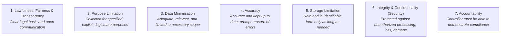
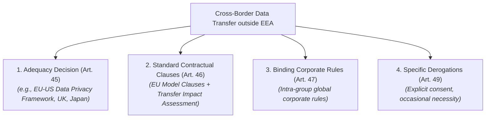

# EU General Data Protection Regulation (GDPR)

## Purpose

Operational reference for Regulation (EU) 2016/679 (GDPR), the legal benchmark governing the processing of personal data, individual privacy rights, technical and organizational security controls, cross-border data transfers, and accountability obligations.

## Upstream & Authority

- Primary Authority: European Data Protection Board (EDPB) & National Data Protection Authorities (DPAs)
- Legal Instrument: Regulation (EU) 2016/679 of the European Parliament and of the Council
- Effective Date: May 25, 2018
- Extraterritorial Jurisdiction (Art. 3): Applies to entities established in the EU, as well as non-EU entities offering goods or services to, or monitoring the behavior of, data subjects located within the EU.

---

## The 7 Core Data Protection Principles (Art. 5)

Every processing activity involving personal data must adhere to seven foundational principles:

---

## Lawful Bases for Processing (Art. 6 & Art. 9)

Personal data processing is prohibited unless at least one lawful basis under **Article 6(1)** applies:

1. **Consent (Art. 6(1)(a)):** Freely given, specific, informed, and unambiguous indication of wishes via clear affirmative action.
2. **Performance of a Contract (Art. 6(1)(b)):** Processing necessary for the performance of a contract to which the data subject is party.
3. **Legal Obligation (Art. 6(1)(c)):** Processing necessary for compliance with a statutory legal obligation.
4. **Vital Interests (Art. 6(1)(d)):** Processing necessary to protect the life or physical integrity of the data subject or another person.
5. **Public Task (Art. 6(1)(e)):** Processing necessary for tasks carried out in the public interest or official authority.
6. **Legitimate Interests (Art. 6(1)(f)):** Processing necessary for legitimate interests pursued by the controller or a third party, except where overridden by the fundamental rights and freedoms of the data subject.

### Special Category Data (Art. 9)
Processing of genetic, biometric, health, racial/ethnic, political, religious, or sexual orientation data is strictly prohibited unless specific exceptions apply (explicit consent, vital healthcare, legal claims, public health).

---

## Chapter III: Data Subject Rights (Arts. 12–23)

Organizations must implement technical workflows to fulfill data subject requests without undue delay (within **1 month**):

| Article | Right | Operational Implementation Mandate |
| --- | --- | --- |
| **Art. 15** | Right of Access | Provide copy of personal data processed, purposes, categories, recipients, and retention periods. |
| **Art. 16** | Right to Rectification | Enable users to rectify inaccurate data or complete incomplete profiles across databases. |
| **Art. 17** | Right to Erasure ("Right to be Forgotten") | Permanently delete or anonymize personal data when consent is withdrawn or purpose ceases, cascading deletes to processors. |
| **Art. 18** | Right to Restriction of Processing | Restrict processing (quarantine / freeze data) while accuracy or legal contests are resolved. |
| **Art. 20** | Right to Data Portability | Export personal data in a structured, commonly used, and machine-readable format (JSON, CSV). |
| **Art. 21** | Right to Object | Provide immediate mechanism to object to processing based on legitimate interests or direct marketing. |
| **Art. 22** | Automated Decision-Making & Profiling | Safeguard against decisions based solely on automated processing/AI producing legal or significant effects without human intervention. |

---

## Core Operational Obligations for Engineering & Ops

### 1. Data Protection by Design & by Default (Art. 25)
Implement appropriate technical and organizational measures (pseudonymization, least privilege, zero default opt-ins) from initial architecture design through decommissioning.

### 2. Record of Processing Activities (RoPA) (Art. 30)
Maintain a detailed, up-to-date registry of processing activities: purposes, data categories, recipient categories, cross-border transfers, retention limits, and security measures.

### 3. Security of Processing (Art. 32)
Mandates technical controls calibrated to risk:
- Pseudonymization and encryption of personal data (TLS in transit, AES at rest).
- Ability to ensure ongoing confidentiality, integrity, availability, and resilience of processing systems.
- Ability to restore availability and access to personal data in a timely manner after an incident.
- Process for regularly testing, assessing, and evaluating the effectiveness of security measures.

### 4. 72-Hour Personal Data Breach Notification (Arts. 33 & 34)
- **To Supervisory Authority (Art. 33):** Notify the lead Data Protection Authority without undue delay and, where feasible, **not later than 72 hours** after becoming aware of a personal data breach presenting a risk to rights and freedoms.
- **To Data Subjects (Art. 34):** Communicate the breach without undue delay to affected individuals if the breach is likely to result in a **high risk** to their rights and freedoms (unless effective encryption rendered data unintelligible).

### 5. Data Protection Impact Assessment (DPIA) (Art. 35)
Conduct a formal DPIA prior to processing when deploying new technologies (e.g., AI/ML systems, automated profiling, large-scale biometric tracking) likely to result in high risk to individuals.

### 6. Data Protection Officer (DPO) (Arts. 37–39)
Mandatory designation of an independent DPO when core activities involve large-scale regular and systematic monitoring of individuals, or large-scale processing of special categories of data.

---

## International Data Transfers (Chapter V)

Transferring personal data outside the European Economic Area (EEA) requires an approved transfer mechanism:

---

## Administrative Fines & Sanctions (Art. 83)

| Tier | Violations Covered | Maximum Administrative Penalty |
| --- | --- | --- |
| **Tier 1 (Lesser)** | Infringements of controller/processor obligations (Arts. 8, 11, 25–39, 42, 43 — e.g., missing RoPA, late breach notification, missing DPIA). | Up to **€10,000,000**, or up to **2%** of total global annual turnover of preceding fiscal year, whichever is higher. |
| **Tier 2 (Severe)** | Infringements of basic processing principles (Arts. 5, 6, 9), data subject rights (Arts. 12–22), or cross-border transfer rules (Arts. 44–49). | Up to **€20,000,000**, or up to **4%** of total global annual turnover of preceding fiscal year, whichever is higher. |
