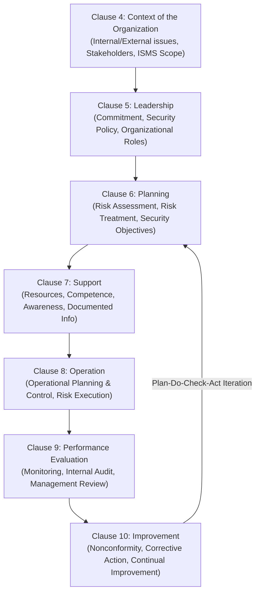
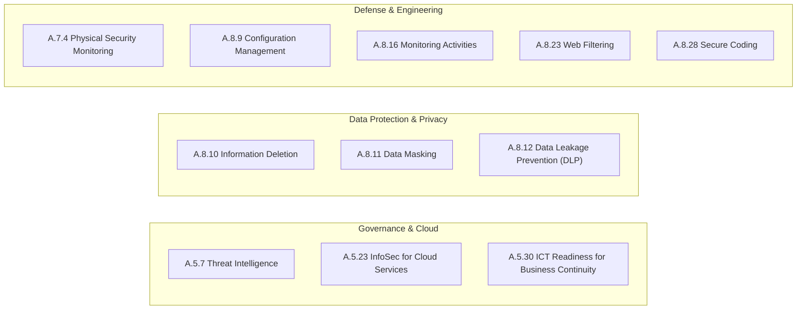

# ISO/IEC 27001:2022 Information Security Management Systems (ISMS)

## Purpose

Operational reference for ISO/IEC 27001:2022, the globally recognized benchmark specification for establishing, implementing, maintaining, and continually improving an Information Security Management System (ISMS), and the companion control set defined in ISO/IEC 27002:2022.

## Upstream & Authority

- Primary Authority: International Organization for Standardization (ISO) & International Electrotechnical Commission (IEC)
- Core Publications:
  - **ISO/IEC 27001:2022:** ISMS Requirements (Clauses 4–10 & Annex A)
  - **ISO/IEC 27002:2022:** Information security, cybersecurity and privacy protection — Information security controls
- Extended Ecosystem: ISO/IEC 27701 (Privacy Information Management System - PIMS), ISO/IEC 27017 (Cloud Security), ISO/IEC 27018 (Cloud Privacy).

---

## ISMS Core Management Clauses (Clauses 4–10)

Mandatory management system requirements for certification:

---

## Annex A Control Architecture (93 Controls in 4 Themes)

The 2022 revision consolidated the previous 114 controls (2013 version) into **93 controls** categorized into **4 structural themes**:

| Theme | Control Range | Total Controls | Focus Area |
| --- | --- | --- | --- |
| **Organizational Controls** | A.5.1 – A.5.37 | 37 | Information security policies, organization of information security, asset management, access control governance, cryptography, supplier relationships, incident management, compliance. |
| **People Controls** | A.6.1 – A.6.8 | 8 | Screening, terms and conditions of employment, security awareness and training, disciplinary process, post-employment responsibilities, confidentiality agreements. |
| **Physical Controls** | A.7.1 – A.7.14 | 14 | Physical security perimeters, entry controls, securing offices, physical security monitoring, working in secure areas, clear desk/screen, equipment maintenance and disposal. |
| **Technological Controls** | A.8.1 – A.8.34 | 34 | User endpoint devices, privileged access rights, access restriction, secure authentication, capacity management, anti-malware, vulnerability management, configuration management, data masking, DLP, monitoring, network security, web filtering, secure coding. |

---

## The 11 New Controls in the 2022 Revision

ISO/IEC 27001:2022 introduced 11 new, forward-looking controls addressing modern cloud and cyber threats:

| Control ID | Control Name | Theme | Practical Implementation Mandate |
| --- | --- | --- | --- |
| **A.5.7** | Threat Intelligence | Organizational | Collect, analyze, and contextualize information relating to information security threats to produce actionable intelligence. |
| **A.5.23** | Information Security for Cloud Services | Organizational | Define security requirements for the acquisition, use, management, and exit of cloud services (shared responsibility matrix). |
| **A.5.30** | ICT Readiness for Business Continuity | Organizational | Ensure ICT infrastructure and services are resilient and meet availability requirements during disruptions. |
| **A.7.4** | Physical Security Monitoring | Physical | Continuously monitor physical premises (CCTV, intrusion alarms, access logs) to prevent unauthorized entry. |
| **A.8.9** | Configuration Management | Technological | Establish, document, monitor, and enforce secure baseline configurations (IaC, gold images, CIS Benchmarks). |
| **A.8.10** | Information Deletion | Technological | Securely delete data when no longer required to comply with privacy regulations and minimize risk. |
| **A.8.11** | Data Masking | Technological | Apply anonymization, pseudonymization, hashing, or masking to sensitive data according to data classification. |
| **A.8.12** | Data Leakage Prevention (DLP) | Technological | Apply DLP controls to systems and networks processing sensitive information to prevent exfiltration. |
| **A.8.16** | Monitoring Activities | Technological | Monitor networks, systems, and application behavior for anomalies, unauthorized events, and intrusion signatures. |
| **A.8.23** | Web Filtering | Technological | Filter and block access to unauthorized or malicious websites to reduce exposure to web-based attacks. |
| **A.8.28** | Secure Coding | Technological | Apply secure coding principles (OWASP, static/dynamic SAST/DAST analysis, peer review) throughout software development. |

---

## 5 Control Attributes System

Each control in ISO/IEC 27002:2022 includes five standardized metadata attributes for matrix tagging and cross-framework mapping:

1. **Control Type:** `#Preventive`, `#Detective`, `#Corrective`
2. **Information Security Properties:** `#Confidentiality`, `#Integrity`, `#Availability`
3. **Cybersecurity Concepts:** `#Identify`, `#Protect`, `#Detect`, `#Respond`, `#Recover` (Directly aligned with **NIST CSF**)
4. **Operational Capabilities:** `#Governance`, `#Asset_management`, `#Information_protection`, `#Human_resource_security`, `#Physical_security`, `#System_and_network_security`, `#Application_security`, `#Secure_configuration`, `#Identity_and_access_management`, `#Threat_and_vulnerability_management`, `#Continuity`, `#Supplier_relationships_security`, `#Legal_and_compliance`, `#Information_security_event_management`, `#Information_security_assurance`
5. **Security Domains:** `#Governance_and_ecosystem`, `#Protection`, `#Defense`, `#Resilience`

---

## Statement of Applicability (SoA)

The **Statement of Applicability (SoA)** is a mandatory ISO 27001 document that:
- Identifies which of the 93 Annex A controls have been selected.
- Justifies why each selected control is necessary based on the formal Risk Assessment and legal/contractual obligations.
- Documents the implementation status of each selected control.
- Explicitly justifies the exclusion of any Annex A controls deemed not applicable.
