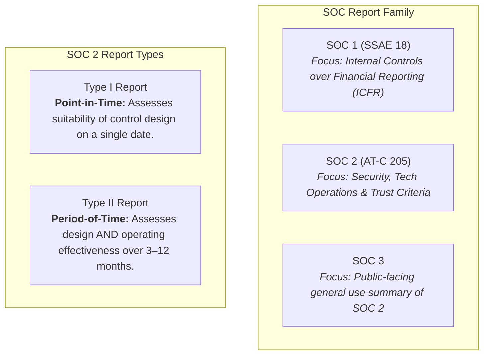
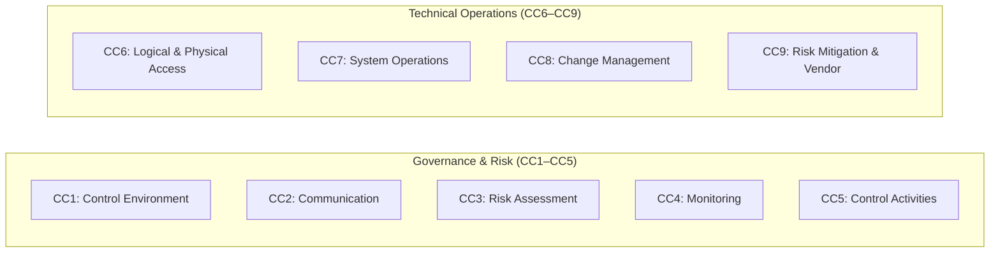

# AICPA SOC 2 & Trust Services Criteria (TSC)

## Purpose

Operational reference for the American Institute of Certified Public Accountants (AICPA) System and Organization Controls 2 (SOC 2) attestation standard and Trust Services Criteria (TSC), governing security, availability, processing integrity, confidentiality, and privacy for cloud and technology service providers.

## Upstream & Authority

- Primary Authority: American Institute of CPAs (AICPA)
- Attestation Standard: Statement on Standards for Attestation Engagements (SSAE) No. 18 / AT-C Section 205
- Evaluation Criteria: 2017 Trust Services Criteria with revised points of focus (2022)
- Target Organizations: SaaS platforms, cloud infrastructure providers, B2B technology vendors, and managed service providers (MSPs).

---

## SOC Report Taxonomy & Evaluation Types

---

## The 5 Trust Services Categories

Organizations must include **Security (Common Criteria)** in every SOC 2 scope, and may optionally add one or more additional categories based on business model and customer commitments:

| Category | Identifier | Scope & Core Purpose | Mandatory in Scope? |
| --- | --- | --- | --- |
| **Security (Common Criteria)** | **CC** | Information and systems are protected against unauthorized access, unauthorized disclosure of information, and damage to systems. | **Mandatory (Base standard for all SOC 2)** |
| **Availability** | **A** | Information and systems are available for operation and use to meet organizational commitments and requirements. | Optional (Standard for SaaS / Hosting) |
| **Confidentiality** | **C** | Information designated as confidential is protected to meet organizational commitments. | Optional (Standard for IP / B2B data) |
| **Processing Integrity** | **PI** | System processing is complete, valid, accurate, timely, and authorized. | Optional (Standard for Financial / Billing engines) |
| **Privacy** | **P** | Personal information is collected, used, retained, disclosed, and disposed to meet commitments. | Optional (Standard for B2C / PII processors) |

---

## The Common Criteria (CC Series: CC1–CC9)

Security criteria are structured around the 17 principles of the **COSO 2013** internal control framework plus supplemental criteria:

### CC1: Control Environment (COSO Principles 1–5)
- Tone at the top, integrity, ethical values, board independence, organizational structure, competence, and accountability.

### CC2: Communication & Information (COSO Principles 13–15)
- Internal communication of objectives and responsibilities; external communication regarding system availability and security policies.

### CC3: Risk Assessment (COSO Principles 6–9)
- Formal risk assessment process identifying operational, environmental, fraud, and technology risks.

### CC4: Monitoring Activities (COSO Principles 16–17)
- Ongoing evaluations, internal audits, vulnerability management, and remediation tracking.

### CC5: Control Activities (COSO Principles 10–12)
- Selection, development, and enforcement of general controls over technology and policies.

### CC6: Logical & Physical Access Controls (Supplemental Criteria CC6.1–CC6.8)
- **CC6.1:** Access restriction based on RBAC and least privilege.
- **CC6.2:** User registration, credential provisioning, and timely deprovisioning.
- **CC6.3:** Access revocation upon termination.
- **CC6.4:** Physical access restrictions to data centers and facilities.
- **CC6.5:** Logical separation of customer data in multi-tenant environments.
- **CC6.6:** Boundary protection (firewalls, VPCs, network segmentation).
- **CC6.7:** Transmission data encryption (TLS 1.2+) and data-at-rest encryption (AES-256).
- **CC6.8:** Prevention and detection of unauthorized / malicious code.

### CC7: System Operations (Supplemental Criteria CC7.1–CC7.5)
- **CC7.1:** Vulnerability management, patch cadence, and automated scanning.
- **CC7.2:** Real-time monitoring, log centralization (SIEM), anomaly detection.
- **CC7.3 & CC7.4:** Incident response, triage, escalation, and post-mortem analysis.
- **CC7.5:** Incident recovery and restoration procedures.

### CC8: Change Management (Supplemental Criteria CC8.1)
- Authorization, design, testing in non-production, peer review, and release approval of all infrastructure, configuration, and software changes.

### CC9: Risk Mitigation & Vendor Management (Supplemental Criteria CC9.1–CC9.2)
- Identification and management of business disruptions and third-party vendor risks (vendor SOC reviews, subservice organization controls).

---

## Supplemental Trust Categories (A, C, PI, P)

### Availability Criteria (A1.1–A1.3)
- Performance and capacity management; automated autoscaling.
- Disaster recovery planning, daily encrypted backups, multi-region replication, and annual failover simulations.

### Confidentiality Criteria (C1.1–C1.2)
- Clear classification of confidential information, retention periods, and cryptographic erasure upon contract termination.

### Processing Integrity Criteria (PI1.1–PI1.5)
- Automated input validation, idempotency, data completeness checks, and exception logging in transactional processing workflows.

### Privacy Criteria (P1.1–P8.1)
- Comprehensive privacy notice, consent management, data subject access/deletion request mechanisms, and third-party disclosure controls (aligned with GDPR/CCPA).

---

## Audit Evidence & Operational Gotchas

1. **Continuous Evidence Gap in Type II Audits:** While a Type I audit checks a single moment, a Type II audit samples evidence across the entire 6–12 month window. A single unapproved change ticket or missed quarterly access review can trigger an auditor exception.
2. **Missing Offboarding Timestamps:** Terminating employees in HR but delaying disabling their SSO/GitHub/AWS access beyond the internal SLA.
3. **Unreviewed Subservice Organizations:** Failing to obtain and document annual review of SOC reports for key vendors (AWS, Datadog, Okta, Cloudflare).
4. **Lack of Automated Branch Protection:** Permitting direct pushes to `main` without PR approvals and passing CI builds violates CC8.1.
