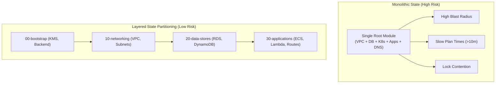
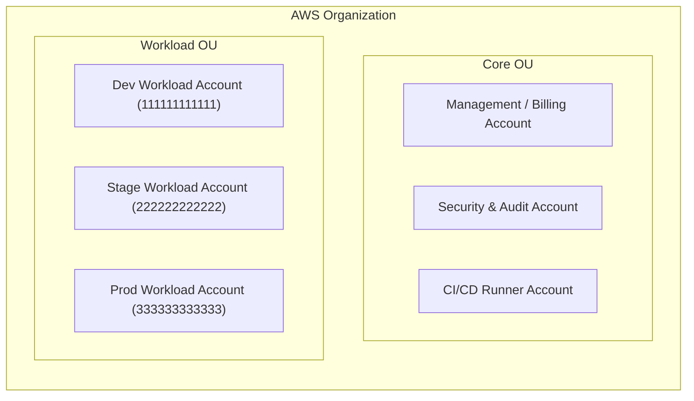

# Terraform & OpenTofu Best Practices

## Purpose

Authoritative architectural reference and operational best practices for Terraform (HashiCorp) and OpenTofu infrastructure configurations, directory layout patterns, blast-radius reduction, environment isolation, module design ergonomics, and resource tagging standards.

## Upstream & Authority

- Primary Authority: HashiCorp Terraform Documentation & OpenTofu Project
- Standard Framework: HashiCorp Module Creation Recommended Patterns & AWS Well-Architected Framework (Reliability and Operational Excellence Pillars)
- Reference Specifications: OpenTofu Architecture Guidelines & HashiCorp Well-Architected IaC Patterns

---

## Directory Hierarchy & Layout Patterns

Modern IaC platforms organize configurations into composable root modules and reusable child modules. Storing all infrastructure in a single root module creates a monolithic state file that slows execution, magnifies blast radius, and introduces concurrency locking bottlenecks.

### Recommended Repository Layout

```text
ai-router-infra/
├── .github/
│   └── workflows/
│       ├── terraform-plan.yml
│       └── terraform-apply.yml
├── modules/                        # Reusable child modules (encapsulated, versioned)
│   ├── networking-vpc/
│   │   ├── main.tf
│   │   ├── variables.tf
│   │   ├── outputs.tf
│   │   ├── versions.tf
│   │   └── README.md
│   ├── ecs-service/
│   └── secure-s3-bucket/
└── environments/                   # Root modules organized by account/environment & layer
    ├── dev/
    │   ├── 00-bootstrap/           # State backend, KMS keys, baseline IAM
    │   ├── 10-networking/          # VPC, subnets, routing, security groups
    │   ├── 20-data-stores/         # Aurora/RDS, Redis, DynamoDB, S3
    │   └── 30-applications/        # ECS services, Lambda, API Gateway
    ├── stage/
    │   ├── 00-bootstrap/
    │   ├── 10-networking/
    │   ├── 20-data-stores/
    │   └── 30-applications/
    └── prod/
        ├── 00-bootstrap/
        ├── 10-networking/
        ├── 20-data-stores/
        └── 30-applications/
```

### Module Anatomy Conventions

Every reusable module under `modules/` must follow standard naming and structural conventions:

| File | Purpose | Rule |
| --- | --- | --- |
| `main.tf` | Primary resource definitions and locals | Declare core resources; keep data blocks and locals grouped logically. |
| `variables.tf` | Input variable declarations | Every variable must have explicit `type`, `description`, and sensible `default` (or none if required). |
| `outputs.tf` | Output value exports | Every output must have a clear `description`. Mark secrets with `sensitive = true`. |
| `versions.tf` | Required Terraform/OpenTofu & provider versions | Specify `required_version` and `required_providers` with semantic constraints. |
| `README.md` | Module documentation | Document inputs, outputs, usage examples, and required IAM permissions (can be auto-generated via `terraform-docs`). |

---

## Blast-Radius Reduction Strategies

The blast radius of an IaC configuration is the maximum extent of infrastructure disruption caused by an erroneous change, failed plan, state lock failure, or credential compromise.



### Layer Separation Rules

1. **Partition by Lifecycle and Rate of Change:**
   - **Slow-changing infrastructure (Bootstrap, Networking, Base IAM):** Updated quarterly or semi-annually. High criticality.
   - **Medium-changing infrastructure (Data stores, message queues, caches):** Updated monthly. High criticality.
   - **Fast-changing infrastructure (Application services, ingress routes, feature flags):** Updated daily or multiple times per day. Scoped criticality.
2. **State Isolation:**
   - Each layer maintains its own isolated remote state file (e.g., `prod/networking/terraform.tfstate`, `prod/applications/terraform.tfstate`).
   - A catastrophic failure in an application rollout cannot inadvertently delete or corrupt core networking or database state.
3. **Decoupled Cross-Layer Data Sharing:**
   - **Anti-Pattern:** Direct cross-state tight coupling via `data "terraform_remote_state"` with excessive access permissions.
   - **Best Practice:** Publish exported IDs (VPC ID, Subnet IDs, KMS Key ARNs) to **AWS SSM Parameter Store** (standard parameters) or **AWS Secrets Manager**, and consume them in downstream layers via `data "aws_ssm_parameter"`.

```hcl
# Upstream Layer (10-networking/outputs.tf)
resource "aws_ssm_parameter" "vpc_id" {
  name        = "/infra/${var.environment}/networking/vpc_id"
  type        = "String"
  value       = aws_vpc.main.id
  description = "VPC ID for ${var.environment}"
}

# Downstream Layer (30-applications/data.tf)
data "aws_ssm_parameter" "vpc_id" {
  name = "/infra/${var.environment}/networking/vpc_id"
}

locals {
  vpc_id = data.aws_ssm_parameter.vpc_id.value
}
```

---

## Environment Segregation: Dev / Stage / Prod

### Multi-Account Boundary Architecture

Never mix production and non-production infrastructure in the same AWS account or single cloud tenant:



### Directories vs Workspaces

| Approach | Suitable Use Case | Drawbacks for Multi-Environment |
| --- | --- | --- |
| **Directory Separation** (`environments/dev`, `environments/prod`) | **Standard for Dev / Stage / Prod** across separate accounts. | Minimal duplication of root module caller blocks. |
| **HCL Workspaces** (`terraform workspace select prod`) | Ephemeral feature environments or identical multi-region footprints within a **single account**. | Shared backend config, easy human error running against wrong workspace, cannot easily configure separate AWS account provider blocks per workspace. |

### Environment Promotion Model

1. Infrastructure code resides on the `main` branch.
2. Configuration values differ only via explicit variables (`terraform.tfvars` per directory) or targeted module inputs.
3. Changes are deployed to `dev` automatically upon PR merge.
4. Changes are promoted to `stage` upon validation.
5. Changes are deployed to `prod` via gated release workflows requiring dual approval and plan artifact validation.

---

## DRY vs Readability Trade-offs

The "DRY (Don't Repeat Yourself) Trap" in Infrastructure as Code occurs when engineers introduce complex layers of loops, conditional logic (`count = var.enabled ? 1 : 0`), dynamic blocks, and meta-modules to eliminate any repeated HCL lines.

### Principles for Clean HCL

1. **Prefer Explicit Composition Over Opaque Abstraction:**
   - 10 lines of simple, readable HCL calling a well-defined child module is vastly superior to a 500-line "universal module" packed with 50 boolean flags and nested `dynamic` blocks.
2. **Module Scope & Cohesion:**
   - Reusable modules should represent a single logical architectural component (e.g., an S3 bucket with compliance guardrails, an ECS Fargate service with its task definition and target group).
   - Avoid "god modules" that attempt to provision an entire ecosystem in one wrapper.
3. **Variable Surface Area:**
   - Expose only the parameters that consumers actually need to vary across environments.
   - Hardcode organizational invariants (e.g., encryption mandatory, public access blocked, TLS 1.2 enforced) inside the child module rather than making them optional input booleans.
4. **Avoid Module Nesting Depth > 2:**
   - Root module $\rightarrow$ Child module (Acceptable).
   - Root module $\rightarrow$ Composite module $\rightarrow$ Sub-module $\rightarrow$ Base module (Prohibited Anti-pattern).

---

## Resource Tagging Standards

Consistent tagging is essential for cost allocation, access control (ABAC), operational lifecycle management, and security posture tracking.

### Mandatory Tagging Schema

| Tag Key | Format / Allowed Values | Purpose | Example |
| --- | --- | --- | --- |
| `Environment` | `dev` \| `stage` \| `prod` \| `sandbox` | Environment classification | `prod` |
| `Owner` | Team email or Slack channel | Operational and incident escalation | `platform-eng@company.internal` |
| `ManagedBy` | `terraform` \| `opentofu` | Automation control plane marker | `terraform` |
| `CostCenter` | Valid ERP / accounting code | Financial chargeback and FinOps | `cc-4820-platform` |
| `Project` | Lowercase kebab-case identifier | Application / System grouping | `ai-router` |
| `DataClassification` | `public` \| `internal` \| `confidential` \| `restricted` | Data sensitivity perimeter | `confidential` |
| `Repository` | GitHub org and repo name | Source code traceability | `Koality-Assured/ai-router` |

### Automated Tag Propagation via `default_tags`

Configure mandatory baseline tags at the AWS provider level to guarantee inheritance across all provisioned resources without manual tagging per resource block:

```hcl
provider "aws" {
  region = var.aws_region

  default_tags {
    tags = {
      Environment        = var.environment
      Owner              = var.team_owner
      ManagedBy          = "terraform"
      CostCenter         = var.cost_center
      Project            = "ai-router"
      DataClassification = var.data_classification
      Repository         = "Koality-Assured/ai-router"
    }
  }
}
```

### Handling Resource-Specific Tags

When individual resources require supplementary tags (e.g., `Name`, `Tier`, `BackupSchedule`), combine them explicitly:

```hcl
resource "aws_s3_bucket" "audit_logs" {
  bucket = "${var.environment}-ai-router-audit-logs"

  tags = {
    Name           = "${var.environment}-audit-logs"
    Tier           = "security"
    BackupSchedule = "daily-replicated"
  }
}
```

---

## Sources & Further Reading

- [HashiCorp Terraform — Standard Module Structure](https://developer.hashicorp.com/terraform/language/modules/develop/structure)
- [HashiCorp Terraform — Recommended Practices](https://developer.hashicorp.com/terraform/tutorials/cloud/recommended-practices)
- [OpenTofu — Language & Architecture](https://opentofu.org/docs/language/)
- [AWS Well-Architected Framework — Reliability Pillar](https://docs.aws.amazon.com/wellarchitected/latest/reliability-pillar/welcome.html)
