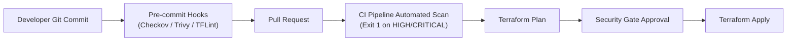
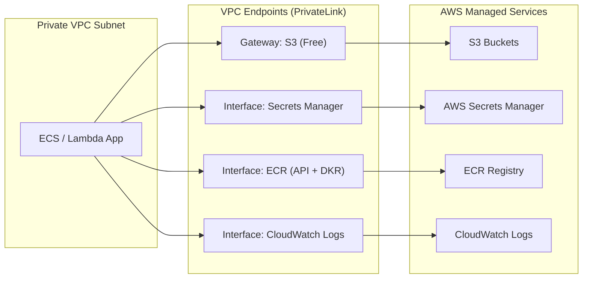

# Cloud Security Baselines & Policy-as-Code

## Purpose

Authoritative security reference for Terraform and OpenTofu IaC configurations, mapping compliance controls from the **Center for Internet Security (CIS) AWS Foundations Benchmark v3.0**, static analysis rule engines (**Checkov**, **tfsec / Trivy**), Instance Metadata Service v2 (IMDSv2) enforcement, S3 public access prevention, customer-managed KMS encryption, VPC private endpoints, and zero-plaintext secret workflows.

## Upstream & Authority

- Primary Authority: Center for Internet Security (CIS) & Bridgecrew / Palo Alto Networks & Aqua Security
- Compliance Standard: CIS Amazon Web Services Foundations Benchmark v3.0.0
- Static Policy Engines: Checkov (v3.x), tfsec / Trivy Scanner
- Target CSP: Amazon Web Services (AWS Provider `>= 5.0`)

---

## CIS AWS Foundations Benchmark v3.0 Mapping

The following table maps essential CIS AWS v3.0 benchmark controls directly to IaC implementation requirements:

| CIS Section | Control ID | Control Description | IaC Implementation Pattern | Checkov / tfsec ID |
| --- | --- | --- | --- | --- |
| **1. IAM** | 1.16 | Ensure IAM policies do not allow full `*:*` administrative privileges | Limit actions and resources in `aws_iam_policy_document` | `CKV_AWS_109`<br>`CKV_AWS_111` |
| **1. IAM** | 1.17 | Ensure IAM role trust policies restrict STS AssumeRole actions | Require specific principal ARNs and condition blocks (`sts:ExternalId`, OIDC claims) | `CKV_AWS_60` |
| **2. Storage** | 2.1.1 | Ensure S3 bucket public access block is enabled at bucket and account level | Create `aws_s3_bucket_public_access_block` with all 4 booleans set to `true` | `CKV_AWS_53`<br>`CKV_AWS_54` |
| **2. Storage** | 2.1.2 | Ensure S3 bucket policy denies HTTP / non-TLS requests | Add explicit `Deny` statement with `"aws:SecureTransport": "false"` condition | `CKV_AWS_21` |
| **2. Storage** | 2.1.3 | Ensure S3 buckets have default encryption enabled using KMS CMK | Configure `aws_s3_bucket_server_side_encryption_configuration` with `aws:kms` | `CKV_AWS_19`<br>`CKV_AWS_145` |
| **2. Storage** | 2.1.4 | Ensure S3 bucket versioning is enabled | Set `aws_s3_bucket_versioning` status to `Enabled` | `CKV_AWS_214` |
| **2. Storage** | 2.2.1 | Ensure EBS volume encryption is enabled with KMS | Set `encrypted = true` and specify `kms_key_id` on `aws_ebs_volume` or launch templates | `CKV_AWS_3`<br>`CKV_AWS_135` |
| **3. Logging** | 3.1 | Ensure CloudTrail is enabled across all regions with multi-region logging | Set `is_multi_region_trail = true` and `enable_log_file_validation = true` | `CKV_AWS_36`<br>`CKV_AWS_35` |
| **3. Logging** | 3.7 | Ensure CloudWatch log groups have KMS encryption and retention set | Declare `kms_key_id` and set `retention_in_days >= 365` | `CKV_AWS_123`<br>`CKV_AWS_158` |
| **4. Monitoring** | 4.1-4.14 | Ensure metric alarms exist for unauthorized API calls, root logins, and policy changes | Provision `aws_cloudwatch_metric_alarm` linked to CloudTrail filter patterns | `CKV_AWS_14` |
| **5. Networking** | 5.1 | Ensure no security groups allow ingress from `0.0.0.0/0` to port 22 (SSH) | Deny `0.0.0.0/0` on port 22 in `aws_security_group_rule` | `CKV_AWS_24` |
| **5. Networking** | 5.2 | Ensure no security groups allow ingress from `0.0.0.0/0` to port 3389 (RDP) | Deny `0.0.0.0/0` on port 3389 in `aws_security_group_rule` | `CKV_AWS_25` |
| **5. Networking** | 5.4 | Ensure default security group of every VPC restricts all traffic | Configure `aws_default_security_group` with empty ingress and egress | `CKV_AWS_104` |
| **5. Compute** | N/A | Enforce IMDSv2 token requirements on EC2 instances | Set `http_tokens = "required"` and `http_put_response_hop_limit = 1` | `CKV_AWS_79` |

---

## Static Analysis & Policy-as-Code Engine

Policy-as-Code scanners run in pre-commit hooks and CI/CD pull request gates to reject misconfigured HCL before provisioning.



### Key Checkov Policy Rules Reference

- `CKV_AWS_18`: Ensure S3 bucket has access logging enabled.
- `CKV_AWS_19`: Ensure S3 bucket is encrypted by default (SSE-S3 or SSE-KMS).
- `CKV_AWS_53`: Ensure S3 bucket has block public access enabled.
- `CKV_AWS_79`: Ensure Instance Metadata Service Version 2 (IMDSv2) is required.
- `CKV_AWS_88`: Ensure EC2 instances do not have public IP addresses assigned in private subnets.
- `CKV_AWS_109`: Ensure IAM policy does not allow `*` administrative actions.
- `CKV_AWS_111`: Ensure IAM policy does not grant write access without resource constraints (`Resource = "*"`).
- `CKV_AWS_123`: Ensure CloudWatch log groups are encrypted using KMS CMK.
- `CKV_AWS_135`: Ensure EBS volume encryption is enabled with a Customer Managed Key (CMK).
- `CKV_AWS_145`: Ensure S3 bucket uses Customer Managed Key (KMS CMK) instead of default AWS managed key.
- `CKV_AWS_158`: Ensure CloudWatch log groups specify retention periods to prevent unbounded log storage.

---

## IMDSv2 Enforcement (EC2 & Launch Templates)

The Instance Metadata Service Version 1 (IMDSv1) is vulnerable to Server-Side Request Forgery (SSRF) and open reverse proxies because it uses simple GET requests without session tokens. **IMDSv2 mandates session-oriented PUT requests with `X-aws-ec2-metadata-token` headers and a hop limit of 1**, neutralizing SSRF token exfiltration from container runtimes.

### Compliant HCL Pattern (Launch Template)

```hcl
resource "aws_launch_template" "compute_node" {
  name_prefix   = "ai-router-compute-"
  image_id      = var.ami_id
  instance_type = var.instance_type

  # Enforce IMDSv2 strictly
  metadata_options {
    http_endpoint               = "enabled"
    http_tokens                 = "required" # Mandates IMDSv2
    http_put_response_hop_limit = 1          # Blocks container SSRF exfiltration
    instance_metadata_tags      = "enabled"
  }

  network_interfaces {
    associate_public_ip_address = false
    security_groups             = [aws_security_group.app_sg.id]
  }

  monitoring {
    enabled = true
  }

  tag_specifications {
    resource_type = "instance"
    tags = {
      Name = "ai-router-worker"
    }
  }
}
```

---

## S3 Block Public Access & Ownership

All Amazon S3 buckets must enforce defense-in-depth public access blocking, object ownership takeover, versioning, and HTTPS transport denial:

```hcl
# 1. Base S3 Bucket
resource "aws_s3_bucket" "secure_storage" {
  bucket        = "${var.environment}-ai-router-storage"
  force_destroy = false
}

# 2. Complete S3 Block Public Access (CIS 2.1.1 / CKV_AWS_53, 54, 55, 56)
resource "aws_s3_bucket_public_access_block" "secure_storage_pab" {
  bucket = aws_s3_bucket.secure_storage.id

  block_public_acls       = true
  block_public_policy     = true
  ignore_public_acls      = true
  restrict_public_buckets = true
}

# 3. Enforce Bucket Ownership (Disables S3 ACLs entirely)
resource "aws_s3_bucket_ownership_controls" "secure_storage_ownership" {
  bucket = aws_s3_bucket.secure_storage.id

  rule {
    object_ownership = "BucketOwnerEnforced"
  }
}

# 4. Mandatory Versioning (CIS 2.1.4 / CKV_AWS_214)
resource "aws_s3_bucket_versioning" "secure_storage_versioning" {
  bucket = aws_s3_bucket.secure_storage.id

  versioning_configuration {
    status = "Enabled"
  }
}

# 5. Customer Managed Key (CMK) Encryption (CIS 2.1.3 / CKV_AWS_19, 145)
resource "aws_s3_bucket_server_side_encryption_configuration" "secure_storage_encryption" {
  bucket = aws_s3_bucket.secure_storage.id

  rule {
    apply_server_side_encryption_by_default {
      kms_master_key_id = aws_kms_key.s3_cmk.arn
      sse_algorithm     = "aws:kms"
    }
    bucket_key_enabled = true # Reduces KMS API request costs by ~99%
  }
}

# 6. Enforce TLS 1.2+ Transport Denial (CIS 2.1.2 / CKV_AWS_21)
resource "aws_s3_bucket_policy" "secure_storage_tls_policy" {
  bucket = aws_s3_bucket.secure_storage.id

  policy = jsonencode({
    Version = "2012-10-17"
    Statement = [
      {
        Sid       = "EnforceSecureTransport"
        Effect    = "Deny"
        Principal = "*"
        Action    = "s3:*"
        Resource = [
          aws_s3_bucket.secure_storage.arn,
          "${aws_s3_bucket.secure_storage.arn}/*"
        ]
        Condition = {
          Bool = {
            "aws:SecureTransport" = "false"
          }
          NumericLessThan = {
            "s3:TlsVersion" = "1.2"
          }
        }
      }
    ]
  })
}
```

---

## Default KMS Customer-Managed Key (CMK) Encryption

Cloud native security mandates the use of Customer Managed Keys (CMKs) rather than default AWS-managed keys (`aws/s3`, `aws/ebs`), enabling custom key rotation policies, granular key usage auditing via CloudTrail, and independent IAM access control.

```hcl
resource "aws_kms_key" "app_cmk" {
  description             = "Customer Managed Key for ${var.environment} application data tier"
  deletion_window_in_days = 30
  enable_key_rotation     = true # Mandatory automated 1-year rotation

  policy = data.aws_iam_policy_document.kms_key_policy.json

  tags = {
    Name = "${var.environment}-app-cmk"
  }
}

resource "aws_kms_alias" "app_cmk_alias" {
  name          = "alias/${var.environment}-ai-router-cmk"
  target_key_id = aws_kms_key.app_cmk.key_id
}

data "aws_iam_policy_document" "kms_key_policy" {
  # 1. Enable IAM User Permissions (Root delegation)
  statement {
    sid    = "EnableRootAdministration"
    effect = "Allow"
    principals {
      type        = "AWS"
      identifiers = ["arn:aws:iam::${var.aws_account_id}:root"]
    }
    actions   = ["kms:*"]
    resources = ["*"]
  }

  # 2. Allow Key Users (App Services / Workloads)
  statement {
    sid    = "AllowApplicationUsage"
    effect = "Allow"
    principals {
      type        = "AWS"
      identifiers = [aws_iam_role.app_execution_role.arn]
    }
    actions = [
      "kms:Encrypt",
      "kms:Decrypt",
      "kms:ReEncrypt*",
      "kms:GenerateDataKey*",
      "kms:DescribeKey"
    ]
    resources = ["*"]
  }
}
```

---

## VPC Endpoints & Private Connectivity

Workloads running in private subnets must communicate with AWS APIs (S3, Secrets Manager, ECR, CloudWatch Logs) via **VPC Endpoints (AWS PrivateLink & Gateway Endpoints)** without egressing through NAT Gateways to the public internet.



### Implementation Checklist

1. **S3 Gateway Endpoint:** Always provision `aws_vpc_endpoint` with `vpc_endpoint_type = "Gateway"`. Route table associations are cost-free and provide line-rate throughput.
2. **Interface Endpoints:** Provision Interface Endpoints with dedicated security groups (allow port 443 inbound only from application subnets) and `private_dns_enabled = true`.
3. **Endpoint Policies:** Attach restrictive IAM resource policies to VPC endpoints to block requests destined for accounts outside the organizational tenant.

---

## Zero-Plaintext Secrets Rules

1. **Never Commit Secrets in HCL:**
   - Database passwords, API tokens, third-party credentials, and private keys must never exist as plaintext strings in `.tf`, `.tfvars`, or commit history.
2. **Dynamic Generation & Automated Storage:**
   - Generate database passwords using `random_password` and immediately store them directly into `aws_secretsmanager_secret_version`.
3. **Sensitive Output Masking:**
   - Mark all sensitive variables and outputs with `sensitive = true` to suppress printing in CI/CD plan and apply logs.

```hcl
resource "random_password" "db_password" {
  length           = 32
  special          = true
  override_special = "!#$%&*()-_=+[]{}<>:?"
}

resource "aws_secretsmanager_secret" "db_secret" {
  name                    = "${var.environment}/ai-router/aurora-db"
  kms_key_id              = aws_kms_key.app_cmk.arn
  recovery_window_in_days = 0
}

resource "aws_secretsmanager_secret_version" "db_secret_val" {
  secret_id = aws_secretsmanager_secret.db_secret.id
  secret_string = jsonencode({
    username = "dbadmin"
    password = random_password.db_password.result
  })
}

output "db_secret_arn" {
  description = "ARN of the Secrets Manager secret for the database"
  value       = aws_secretsmanager_secret.db_secret.arn
  sensitive   = false
}
```

---

## Sources & Benchmark Documents

- [CIS Amazon Web Services Foundations Benchmark v3.0.0](https://www.cisecurity.org/benchmark/amazon_web_services)
- [Checkov Static Code Analysis for IaC](https://www.checkov.io/)
- [Aqua Security tfsec Documentation](https://aquasecurity.github.io/tfsec/)
- [AWS Security Best Practices for Amazon S3](https://docs.aws.amazon.com/AmazonS3/latest/userguide/security-best-practices.html)
- [AWS EC2 Instance Metadata Service v2 Guide](https://docs.aws.amazon.com/AWSEC2/latest/UserGuide/configuring-instance-metadata-service.html)
