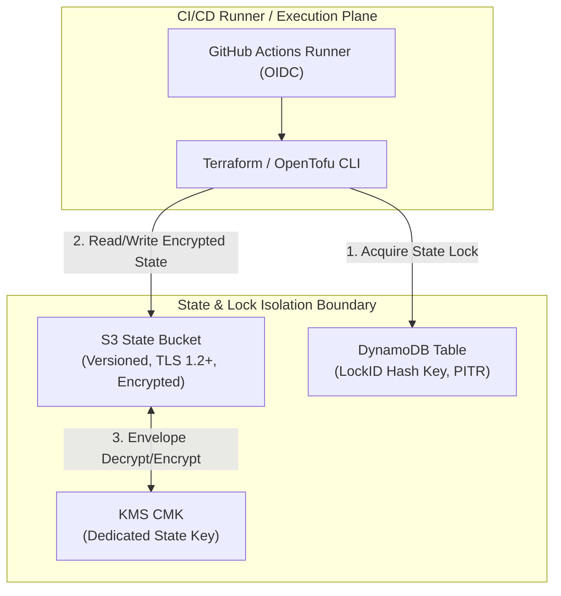
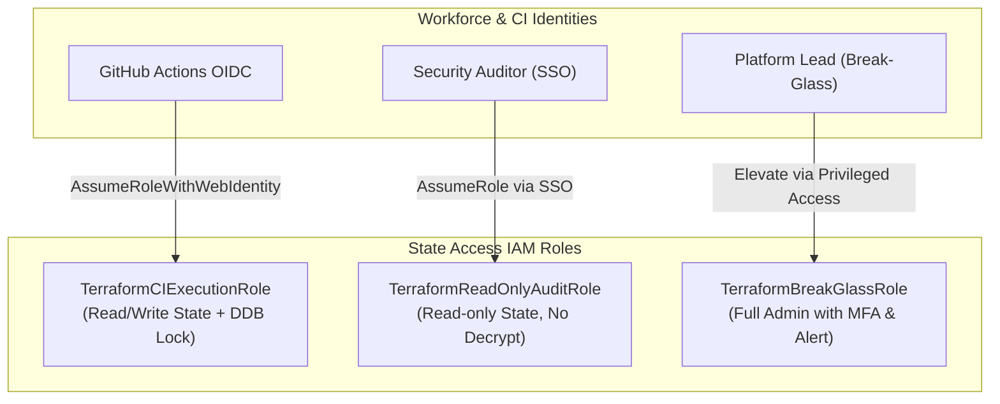

# State & Remote Backend Security

## Purpose

Authoritative reference for architecting and securing Terraform and OpenTofu remote state backends on AWS. Covers Amazon S3 bucket hardening, customer-managed KMS key (CMK) access policies, DynamoDB distributed locking schemas, state secret leak mitigation strategies, OpenTofu client-side encryption, and least-privilege IAM access role hierarchies.

## Upstream & Authority

- Primary Authority: HashiCorp Terraform Backend Documentation & OpenTofu State Encryption Specification
- Security Benchmarks: CIS AWS Foundations Benchmark v3.0 (Section 2.1 Storage & Section 1 IAM)
- Primary Backends: AWS S3 Backend (`backend "s3"`) with DynamoDB State Locking

---

## State Threat Model & Architecture

Terraform state files (`terraform.tfstate`) maintain the mapping between declared HCL configurations and provisioned cloud resources. 



### Inherent State Risks

1. **Plaintext Secrets in State:** Even when inputs and outputs are marked `sensitive = true`, Terraform stores resource attributes (generated passwords, private keys, connection strings, auth tokens) in plaintext within the JSON state file.
2. **State Corruption via Concurrent Execution:** Simultaneous `terraform apply` operations without state locking can write conflicting resource mappings, causing unrecoverable state split-brain.
3. **Over-Privileged State Exposure:** Granting broad read access to the state bucket allows any compromised CI runner or user to extract root database passwords, private keys, and sensitive infrastructure metadata.

---

## Hardened S3 Remote Backend Configuration

### Backend Block Specification

```hcl
terraform {
  required_version = ">= 1.9.0, < 2.0.0"

  backend "s3" {
    bucket         = "company-tfstate-prod-useast1"
    key            = "ai-router/prod/networking/terraform.tfstate"
    region         = "us-east-1"
    encrypt        = true
    kms_key_id     = "arn:aws:kms:us-east-1:111122223333:key/mrk-abcd-1234-state-key"
    dynamodb_table = "company-tflocks-prod"
  }
}
```

### S3 State Bucket Security Invariants

1. **Bucket Versioning:** Must be `Enabled` to allow rollback from accidental state corruption or erroneous state manipulation (`terraform state rm`).
2. **Block Public Access:** All 4 public access block flags set to `true`.
3. **Object Lock / MFA Delete:** Recommended for production state buckets to prevent catastrophic bucket deletion.
4. **Dedicated KMS CMK:** State bucket must be encrypted exclusively with a Customer Managed Key (CMK), never with the shared default `aws/s3` key.
5. **Enforce BucketOwnerEnforced:** Disables all S3 ACLs.

---

## S3 Bucket Policies for Backend Security

The S3 state bucket policy must enforce in-transit encryption (TLS 1.2+) and restrict access strictly to designated Terraform execution roles:

```hcl
resource "aws_s3_bucket_policy" "state_bucket_policy" {
  bucket = aws_s3_bucket.state_bucket.id

  policy = jsonencode({
    Version = "2012-10-17"
    Statement = [
      # 1. Deny Insecure Transport (HTTP)
      {
        Sid       = "EnforceTLSRequestsOnly"
        Effect    = "Deny"
        Principal = "*"
        Action    = "s3:*"
        Resource = [
          aws_s3_bucket.state_bucket.arn,
          "${aws_s3_bucket.state_bucket.arn}/*"
        ]
        Condition = {
          Bool = {
            "aws:SecureTransport" = "false"
          }
        }
      },
      # 2. Enforce Minimum TLS Version 1.2
      {
        Sid       = "EnforceTLS12OrHigher"
        Effect    = "Deny"
        Principal = "*"
        Action    = "s3:*"
        Resource = [
          aws_s3_bucket.state_bucket.arn,
          "${aws_s3_bucket.state_bucket.arn}/*"
        ]
        Condition = {
          NumericLessThan = {
            "s3:TlsVersion" = "1.2"
          }
        }
      },
      # 3. Deny Unencrypted Object Uploads
      {
        Sid       = "DenyUnencryptedObjectUploads"
        Effect    = "Deny"
        Principal = "*"
        Action    = "s3:PutObject"
        Resource  = "${aws_s3_bucket.state_bucket.arn}/*"
        Condition = {
          StringNotEquals = {
            "s3:x-amz-server-side-encryption" = "aws:kms"
          }
        }
      },
      # 4. Enforce Dedicated State KMS CMK
      {
        Sid       = "EnforceStateKMSCMK"
        Effect    = "Deny"
        Principal = "*"
        Action    = "s3:PutObject"
        Resource  = "${aws_s3_bucket.state_bucket.arn}/*"
        Condition = {
          StringNotEquals = {
            "s3:x-amz-server-side-encryption-aws-kms-key-id" = aws_kms_key.state_cmk.arn
          }
        }
      }
    ]
  })
}
```

---

## KMS CMK Key Policy for State Encryption

The KMS CMK policy governs who can encrypt and decrypt the state file. By separating state storage access from key decryption access, security teams establish strong dual-custody defense:

```hcl
resource "aws_kms_key" "state_cmk" {
  description             = "Dedicated KMS Key for Terraform Remote State Encryption"
  deletion_window_in_days = 30
  enable_key_rotation     = true

  policy = data.aws_iam_policy_document.state_kms_policy.json
}

data "aws_iam_policy_document" "state_kms_policy" {
  # Account Root Administration
  statement {
    sid       = "AllowRootAdmin"
    effect    = "Allow"
    principals {
      type        = "AWS"
      identifiers = ["arn:aws:iam::${var.account_id}:root"]
    }
    actions   = ["kms:*"]
    resources = ["*"]
  }

  # Dedicated CI/CD Execution Role
  statement {
    sid       = "AllowStateKMSUsage"
    effect    = "Allow"
    principals {
      type        = "AWS"
      identifiers = [
        "arn:aws:iam::${var.account_id}:role/TerraformCIExecutionRole",
        "arn:aws:iam::${var.account_id}:role/TerraformBreakGlassRole"
      ]
    }
    actions = [
      "kms:Encrypt",
      "kms:Decrypt",
      "kms:ReEncrypt*",
      "kms:GenerateDataKey*",
      "kms:DescribeKey"
    ]
    resources = ["*"]
  }
}
```

---

## DynamoDB State Lock Schema & Configuration

State locking prevents two simultaneous executions from corrupting the state file. DynamoDB provides distributed locking with millisecond consistency.

### Table Schema Requirements

- **Partition Key (Hash Key):** `LockID` (Type: `String` / `S`). Must match this exact name and type for Terraform compatibility.
- **Billing Mode:** `PAY_PER_REQUEST` (On-Demand) to eliminate capacity bottlenecks during concurrent pipeline runs.
- **Point-in-Time Recovery (PITR):** `Enabled`.
- **Server-Side Encryption:** `Enabled` using the dedicated state KMS CMK.

```hcl
resource "aws_dynamodb_table" "state_locks" {
  name         = "company-tflocks-prod"
  billing_mode = "PAY_PER_REQUEST"
  hash_key     = "LockID"

  attribute {
    name = "LockID"
    type = "S"
  }

  point_in_time_recovery {
    enabled = true
  }

  server_side_encryption {
    enabled     = true
    kms_key_arn = aws_kms_key.state_cmk.arn
  }

  deletion_protection_enabled = true

  tags = {
    Name        = "company-tflocks-prod"
    ManagedBy   = "terraform"
    Environment = "prod"
  }
}
```

---

## State Secret Leak Mitigation Strategies

### OpenTofu State Encryption Feature (OpenTofu `>= 1.7`)

OpenTofu provides native client-side encryption of the state file and plan files prior to writing to the remote backend or local disk:

```hcl
# Available in OpenTofu 1.7+
terraform {
  encryption {
    key_provider "aws_kms" "state_key" {
      kms_key_id = "arn:aws:kms:us-east-1:111122223333:key/mrk-state-key"
      region     = "us-east-1"
    }

    method "aes_gcm" "state_aes" {
      keys = key_provider.aws_kms.state_key
    }

    state {
      method = method.aes_gcm.state_aes
      enforced = true
    }

    plan {
      method = method.aes_gcm.state_aes
      enforced = true
    }
  }
}
```

### Operational Secret Leak Safeguards

1. **Avoid Plaintext Attribute Storage:**
   - Prefer IAM roles and IAM authentication (e.g., AWS RDS IAM auth, IAM roles for service accounts) instead of generating and storing static credentials in state.
2. **Ephemeral CI Runners:**
   - Execute Terraform exclusively on ephemeral runners (e.g., GitHub Actions Ephemeral Runners on AWS ECS/EKS).
   - Ensure runner scratch volumes are securely erased immediately upon workflow termination.
3. **Plan File Masking:**
   - Plan files (`tfplan`) contain unencrypted secrets. Encrypt plan files with a temporary KMS key or OpenTofu plan encryption when passing between CI plan and apply jobs.
4. **Remediation of Leaked State Secrets:**
   - If a sensitive credential is confirmed written to state:
     1. Immediately rotate the credential in the target system.
     2. Update IaC to reference external Secrets Manager or IAM authentication.
     3. Remove the resource from state if needed (`terraform state rm <resource>`) and re-import (`terraform import`).

---

## IAM Roles & Least-Privilege Access Architecture



### IAM Role Matrix

| Role Name | Granted State Actions | Granted KMS Actions | Target Principal |
| --- | --- | --- | --- |
| `TerraformCIExecutionRole` | `s3:GetObject`, `s3:PutObject`, `s3:DeleteObject`<br>`dynamodb:GetItem`, `dynamodb:PutItem`, `dynamodb:DeleteItem` | `kms:Encrypt`, `kms:Decrypt`, `kms:GenerateDataKey*` | GitHub Actions OIDC (repository & branch-scoped) |
| `TerraformReadOnlyAuditRole` | `s3:GetObject`, `s3:ListBucket`<br>`dynamodb:GetItem` | None (Cannot decrypt sensitive state payloads) | Security / Compliance Auditors |
| `TerraformBreakGlassRole` | Full S3 & DynamoDB state operations | Full KMS CMK decrypt/encrypt | Emergency Platform Admins (MFA + pager alert) |

---

## Sources & Backend Standards

- [HashiCorp Terraform — S3 Backend Configuration](https://developer.hashicorp.com/terraform/language/settings/backends/s3)
- [OpenTofu — State Encryption Configuration](https://opentofu.org/docs/language/state/encryption/)
- [AWS Security Best Practices for S3 State Buckets](https://docs.aws.amazon.com/prescriptive-guidance/latest/terraform-aws-provider-best-practices/backend.html)
- [DynamoDB State Locking Mechanics](https://developer.hashicorp.com/terraform/language/settings/backends/s3#dynamodb-state-locking)
