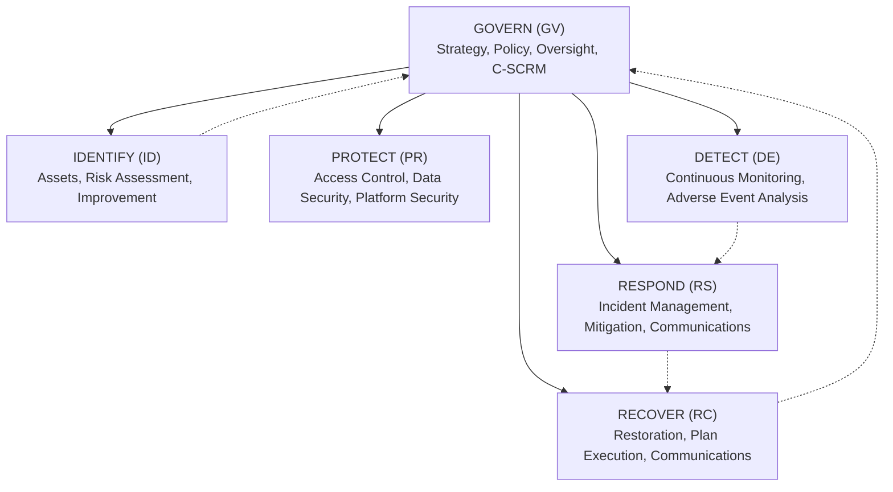

# NIST CSF 2.0 Govern Function (GV)

## Overview

The **Govern (GV)** Function was introduced in NIST Cybersecurity Framework (CSF) 2.0 to provide a foundational, cross-cutting layer that directs and informs the other five Functions (Identify, Protect, Detect, Respond, Recover). 

Govern addresses how an organization establishes, communicates, and monitors its cybersecurity risk management strategy, expectations, policies, and supply chain governance.

- **Primary Outcome:** The organization's cybersecurity risk management strategy, expectations, and policy are established, communicated, and monitored.
- **Scope:** Applies enterprise-wide, aligning executive leadership, risk management, operations, and external partner ecosystems.

## Categories

| Category ID | Category Name | Core Objective |
| --- | --- | --- |
| **GV.OC** | Organizational Context | The circumstances — mission, stakeholder expectations, dependencies, and legal, regulatory, and contractual requirements — surrounding the organization's cybersecurity risk decisions are understood. |
| **GV.RM** | Risk Management Strategy | The organization's priorities, constraints, risk tolerance, and appetite statements are established, communicated, and used to support operational risk decisions. |
| **GV.RR** | Roles, Responsibilities, and Authorities | Cybersecurity roles, responsibilities, and authorities to foster accountability, performance assessment, and continuous improvement are established and communicated. |
| **GV.PO** | Policy | Organizational cybersecurity policy is established, communicated, evaluated, and enforced. |
| **GV.OV** | Oversight | Results of organization-wide cybersecurity risk management activities and performance are used to inform, improve, and adjust the risk management strategy. |
| **GV.SC** | Cybersecurity Supply Chain Risk Management | Cyber supply chain risk management processes are identified, established, managed, monitored, and improved by organizational stakeholders. |

## Category Subcategory Breakdown

### GV.OC: Organizational Context
- **GV.OC-01:** The organizational mission is understood and informs cybersecurity risk management.
- **GV.OC-02:** Internal and external stakeholders and their cybersecurity expectations are understood.
- **GV.OC-03:** Legal, regulatory, and contractual requirements regarding cybersecurity (including privacy) are understood and managed.
- **GV.OC-04:** Critical services and organizational dependencies (external services, technology infrastructure) are understood.
- **GV.OC-05:** Outcomes, capabilities, and capacity are evaluated to determine cybersecurity resource allocations.

### GV.RM: Risk Management Strategy
- **GV.RM-01:** Risk management objectives are established and agreed to by leadership.
- **GV.RM-02:** Risk appetite and risk tolerance statements are established, communicated, and maintained.
- **GV.RM-03:** Cybersecurity risk management activities are integrated into enterprise risk management (ERM).
- **GV.RM-04:** Strategic direction regarding risk response options (accept, mitigate, transfer, avoid) is established.
- **GV.RM-05:** Lines of communication across operational, executive, and board levels are established.
- **GV.RM-06:** Standardized methods for calculating, documenting, and prioritizing risk are established.
- **GV.RM-07:** Strategic opportunities to improve cybersecurity posture are identified and evaluated.

### GV.RR: Roles, Responsibilities, and Authorities
- **GV.RR-01:** Executive leadership is responsible and accountable for cybersecurity risk.
- **GV.RR-02:** Cybersecurity roles and responsibilities are defined, communicated, and coordinated across internal/external entities.
- **GV.RR-03:** Adequate resources (budget, staffing, tooling) are allocated commensurate with cybersecurity strategy.
- **GV.RR-04:** Cybersecurity is integrated into human resource practices (onboarding, performance reviews, offboarding).

### GV.PO: Policy
- **GV.PO-01:** Policy for managing cybersecurity risk is established, approved, and communicated.
- **GV.PO-02:** Policy is reviewed, updated, and communicated to reflect organizational, regulatory, or threat changes.

### GV.OV: Oversight
- **GV.OV-01:** Cybersecurity risk management strategy outcomes are reviewed to verify alignment with organizational objectives.
- **GV.OV-02:** The cybersecurity risk management strategy is adjusted based on internal performance metrics and external threat shifts.
- **GV.OV-03:** Organizational cybersecurity risk performance is evaluated and reported to leadership.

### GV.SC: Cybersecurity Supply Chain Risk Management (C-SCRM)
- **GV.SC-01:** A cybersecurity supply chain risk management program is established, managed, and integrated into broader risk strategy.
- **GV.SC-02:** Cybersecurity roles and responsibilities for suppliers, customers, and partners are established and coordinated.
- **GV.SC-03:** Cybersecurity supply chain risk management is integrated into procurement and contract processes.
- **GV.SC-04:** Suppliers are prioritized by criticality to organizational operations and data sensitivity.
- **GV.SC-05:** Suppliers and third-party partners are assessed prior to entering relationships and monitored periodically.
- **GV.SC-06:** Contracts with suppliers and partners address cybersecurity requirements, data protection, and incident reporting.
- **GV.SC-07:** Supply chain risks from supplier offboarding and termination of services are managed.
- **GV.SC-08:** Supply chain cybersecurity incident planning and coordination are conducted with suppliers and third parties.
- **GV.SC-09:** Supply chain security practices are integrated into incident response and business continuity planning.
- **GV.SC-10:** Supply chain risk management plans include provisions for end-of-life and unsupported technologies.

## Operational Interaction with Other Functions

## Advisory

Advisory reference material. Consult official NIST Special Publication CSWP 29 for formal compliance determinations.
